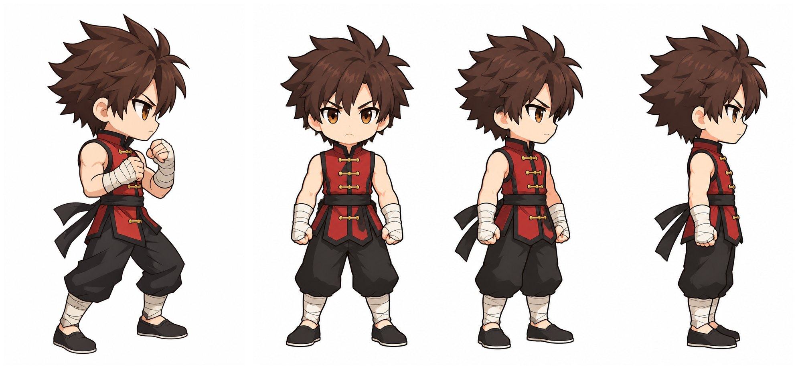
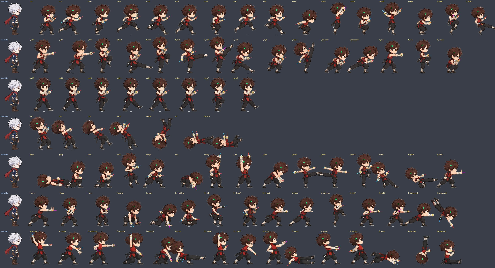
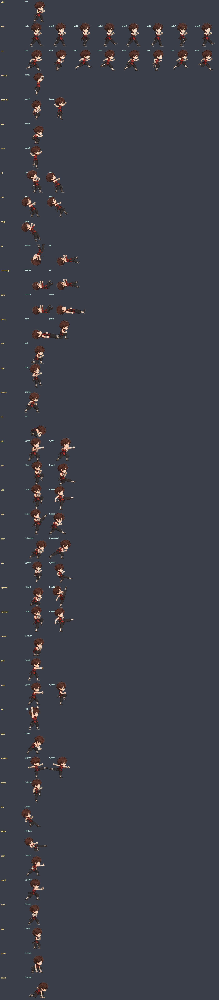
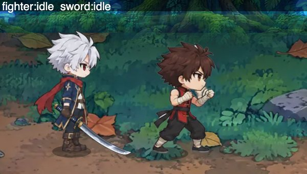
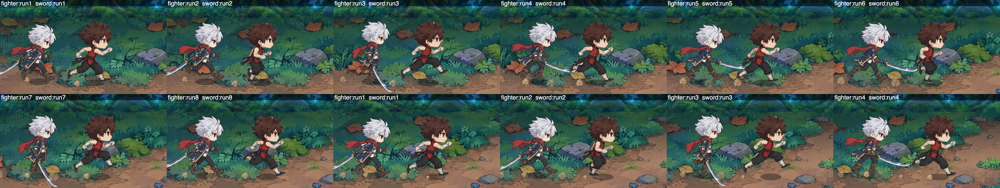
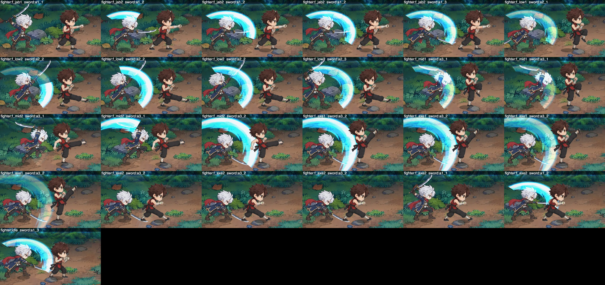
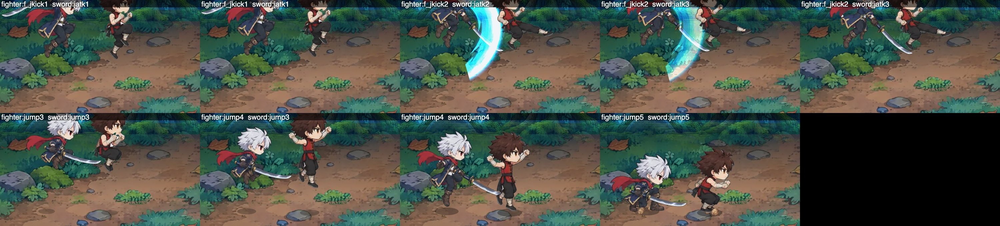

# 格斗家（男）原装帧（B1）

> 2026-09-30。计划见 docs/CLASS_PLAN_FIGHTER.md §3（美术）/ §4 B1。第一阶段（设计定稿 + 4×4 样表）主线程审过 → 第二阶段出全套原装帧（本文 §4 起）。
> 审图只看一张：`art/work/fighter_samples/overview.jpg`（设计三视图 → 91 帧和锚点 → 游戏内和鬼剑士并排：站立 / 跑 / 普攻 4 段）；全部 41 个片段逐帧：`engine_clips.jpg`。

## 1. 结论
- **全套原装帧 91 帧**（7 张 4×4 表）：`SPR_ANIMS.fighter` 的 41 个片段全部换成真帧（游戏内逐片段核对：0 个片段落回兜底帧、0 报错），外加 4 个转职的专属姿势 25 帧（§4.2，给 B4~B7 写 `J.anims` 用）。
- **生图共 12 次、0 失败**：第一阶段 4（原装立绘、三视图、样表 2）+ 第二阶段 8（新表 4、move 重出 2、walk 重出 1、f_mid2 单格返修 1）。老流水线（3×3 + 占位武器轮）出同样 91 帧约 24 次。
- 两个已知问题都修了：跑步起伏（animfeel 头部每步跳 8.0 → 0.91、起伏 10.9 → 1.28）；远侧拳锚点（提示词加强 + 绑带颜色兜底 + 逐个人工核对）。
- 比例 `HEIGHT = 112`（格斗架势 idle 和鬼剑士并排一样大），其余帧按“动作格的头 = idle 的头”自动归一（头部比例偏差中位数 0.02，和鬼剑士一样）。

## 2. 设计定稿（第一阶段，已审）
| 项 | 定稿 |
|---|---|
| 参考 | 按鬼剑士原装立绘（`art/src/sword_ref.png`）的 Q 版比例 / 描边 / 上色生成，同画幅同朝向 |
| 发型 | 深栗棕色刺猬短发，琥珀色眼睛；**不戴头带 / 帽子**（转职靠发色 + 头饰区分，JOB_VISUALS §5） |
| 衣服（新手默认） | 无袖暗红功夫马甲（黑色立领、黑边、金色盘扣）、黑腰带（两条短飘带）、黑灯笼练功裤、米色绑腿、黑布鞋；**双拳和前臂缠米色绑带（空拳）** |
| 站姿 | 轻快的格斗架势（脚尖着地、膝盖微弯、双拳护在胸前 / 下巴） |
| 图 | `art/work/fighter_samples/design.jpg`；选角立绘 `art/final/class/fighter.webp`（原装立绘去白底，不另生图） |



## 3. 做法（`art/tools/fighter_art.py`）
1. **姿势参考小人**（`guides`，4×4 每格 512，蓝 = 近侧、红 = 远侧）：每只拳头画一根沿前臂、从指节伸出的绿棒（D5 双手锚点）；张开的手（推掌、结印、砸地、扔完、挑衅）画三根手指、不画棒（`P(..., open='n'|'nf')`）。
   - `poseguide.py` 的 `lean` 符号是反的（`180 + lean`，正值其实往后仰），fighter_art.py 用自己的 `180 - lean`，没改 poseguide。
2. **4×4 动作表**（`sheets`）：参考图 = 原装立绘 + 姿势小人；提示词逐格写动作，另外锁死：绑带是浅米色（第二版 move 表把拳头画成了深色）、两只拳都要露出棒、脚上永远没有绿色、张开的手不拿棒。
3. **单格返修**（`touch 表 格`，提示词在 `TOUCH`）：放大到 1024 连同原装立绘改图，按身体外框缩放、脚底对齐贴回（原表备份在 `sheets/_pre/`）。
4. **切帧**（`frames`）：复用 avatar_frames（抠绿棒 + 补色 + 握点 / 握拳轮廓）、avatar_head、avatar_cuts；fighter 自己的部分：
   - `cut16`（3×3 → 4×4）、`stick_groups`（只合并首尾挨着的两段：两只拳的平行短棒不会连成一根长棍）；
   - `fist_sticks`：`TOE_FIX` 里的 5 个踢腿帧（生图在脚尖也画了绿棒，逐帧看过）丢掉离脚尖最近的棒；握点相距 < 30 像素的两段算同一只拳；多于两根挑和小人两只手最对得上的一对；再按小人标 `side`（'n' 近侧 / 'f' 远侧）。颜色分不开脚和拳（拳头常贴着黑裤子 / 腰带，脚尖棒的轴线穿进米色绑腿），所以不按颜色判；
   - `clean_frames`：被围住的白底块（外圈是深色描边、≥150 像素）挖掉、绿色偏色压回；
   - **比例两遍**：第一遍按每张表第 1 格（站姿参考）定缩放；生图时第 1 格总比同表动作格画大一点（动作格的头只有 idle 的 0.86~0.96），第二遍按每张表“动作格的头 / idle 的头”的中位数把动作格放大回来（idle 不动）；
   - `hand_anchors`：没有棒的拳头 ① 走路一圈先统一左右标签（两拳护在一起时会标反），缺的从同一圈最近的真锚点抄（`auto: 2`）；② 其余按绑带颜色在小人这只手的位置附近找（排除头部一圈、另一只前臂、膝盖 / 脚），`auto: 1`。**绑带和皮肤颜色几乎一样**（色相 15~41°、饱和度约 0.2），所以找到的逐个看过（`anchors_auto.jpg`），不对的写进 `HAND_FIX`（都是那只拳其实被挡住、找到了下巴 / 另一只胳膊）。
5. **体检**（`check`，结果 `art/work/fighter_samples/check.json`）+ 游戏内（`node art/tools/fighter_shots.mjs`）+ `WEB=1 node test/animfeel.mjs fighter`。

## 4. 全套帧
### 4.1 表和帧（`art/src/fighter/sheets/fighter_<表>.png`，第 1 格都是站姿参考）
| 表 | 帧 |
|---|---|
| move（第三版） | idle、run1~8、jump1~5、f_jkick1/2 |
| combo（样表，f_mid2 单格返修） | f_jab1/2、f_low1/2、f_mid1/2、f_axe1/2、f_high1/2、f_shoulder1/2、f_grab、f_knee、f_crouch |
| walk（第二版，只切走路格） | walk1~8 |
| react（= walk 第一版，只切受击格；第二版的受击格把远侧拳的棒画成了嘴边的褐色棍子） | hit1~3、airUp、tumble、air、bounce |
| base2 | down、getup、tech、held、charge、roll、victory、f_lift、f_slam、f_spin1/2、f_stomp、f_dive、f_flykick、f_palm1 |
| base3 | f_palm2、f_focus、f_seal、f_quake、f_smash、**fn_** meditate / ride / thrust1 / thrust2、**fs_** elbow / kneekick / rush1 / rush2 / dashpunch / divepunch |
| jobs | **fb_** throw1 / throw2 / sidethrow / pound1 / pound2 / slide / chain1 / chain2 / taunt、**fg_** scissor / swing1 / swing2 / press / backflip / piledrive |

### 4.2 给转职块（B4~B7）：专属姿势帧名（`J.anims` 直接引用，帧已在 `SPR_DATA.fighter`）
| 转职 | 帧（§3.2 的动作） |
|---|---|
| 气功师 | `fn_meditate`（盘腿悬空打坐）、`fn_ride`（骑乘，坐姿，坐骑运行时画）、`fn_thrust1/2`（单手雷刃：蓄 / 刺出） |
| 散打 | `fs_elbow`（肘击突进）、`fs_kneekick`（跳膝）、`fs_rush1/2`（左右连拳，可循环）、`fs_dashpunch`（突进重拳）、`fs_divepunch`（俯冲拳，空中） |
| 街霸 | `fb_throw1/2`（上手投掷：举 / 扔出，手张开）、`fb_sidethrow`（侧手甩投）、`fb_pound1/2`（骑乘捶打：举 / 砸，跪姿）、`fb_slide`（贴地滑铲）、`fb_chain1/2`（挥锁链：头顶 / 前甩，锁链运行时画）、`fb_taunt`（挑衅，招手） |
| 柔道家 | `fg_scissor`（空中剪刀腿）、`fg_swing1/2`（抡人：前 / 后，被抓的敌人按抓取框架摆）、`fg_press`（身体压下，空中俯卧）、`fg_backflip`（后空翻，倒立）、`fg_piledrive`（倒插落地，坐姿） |
| 通用备用 | `jump1`（起跳下蹲）、`victory`（胜利姿势），BASE_ANIMS 暂时没用 |

### 4.3 给外观块（B2）：锚点
- 每帧 `head`（91/91）、`cut`（90/91，roll 缩成一团不写）、拳头锚点 `wpn` / `wpn2`（字段同三职业 + `side`：'n' 近侧 / 'f' 远侧；`auto`：1 = 按绑带颜色找的、2 = 走路一圈里抄的，只有握点和前臂方向，没有握拳轮廓 `hand`）。
- 覆盖：两只拳都有 46 帧、一只 44 帧、没有 1 帧（`fs_elbow`，模型没画棒、兜底也找不准）；兜底锚点 16 个。**没锚点的拳头多半是真被身体挡住了**；露在外面但没锚点的（走路的后手护在下巴下、f_jab1/2 的后手等）穿拳上武器时是空拳 → cover 模式要能接受“这一帧只有一只手”。
- 远侧拳的锚点也是 `front: 1`（拳头露在外面才会有锚点），但它在身后那只胳膊上，cover 图会盖在身体上面：B2 画远侧手套时要用握拳轮廓 / 身体遮罩裁一下。
- 时装（B2）直接拿 `art/src/fighter/sheets/fighter_<表>.png` 当占位表（已经带绿棒），不用再跑 `avatar_gen.py wpn`；react 表只切受击格、walk 表只切走路格（`SHEETS` 里名字是 None 的格不切）。




## 5. 体检（和三职业原装同一把尺子）
| 项 | 格斗家 | 鬼剑士 | 神枪手 | 魔法师 |
|---|---|---|---|---|
| 衣服闪烁（avatar_flicker 离群分）walk / run | 0.165 / 0.110 | 0.143 / 0.075 | 0.166 / 0.206 | 0.100 / 0.162 |
| 头部比例（每帧对 idle，偏差中位数；>12% 的帧） | 0.02；bounce、fg_press（躺 / 平趴，头的匹配不准） | 0.02；无 | 0.04；11 帧 | 0.04；2 帧 |
| 动作表逐格（sheetflicker 直方图差） | 0.10~0.17 | 0.07~0.15 | — | — |
| animfeel 走：头部每步最大跳 / 起伏 / 步幅匹配 | 0.42 / 0.39 / 1.04 | 0.48 / 0.78 / 1.14 | | |
| animfeel 跑：头部每步最大跳 / 起伏 / 步幅匹配 | 0.91 / 1.28 / 0.72 | 3.24 / 5.75 / 0.66 | | |
| animfeel 普攻 1 / 跑攻换帧头部跳动 | 12.1 / 13.9（缓动收得住） | 8.8 / 48.4 | | |
| 游戏内（`?fighter=1`） | 41 个片段逐帧对得上、0 兜底、0 报错 | | | |

走 / 跑帧停留全是整数步（CV 0）。锚点都在帧内。






## 6. 生图记录（12 次，全部 sunburst 2048 / 1024，0 失败 0 重试）
| 次 | 内容 | 结果 |
|---|---|---|
| 1~2 | 原装立绘、三视图 | 定稿 |
| 3~4 | move 第一版、combo | 样表过审；combo 沿用 |
| 5~9 | move 第二版、walk、base2、base3、jobs | move 第二版拳头画成深色 → 弃；walk 第一版走路起伏太大 → 只用受击格（react） |
| 10 | combo 第 6 格（f_mid2）单格返修 | 胸前那只拳清楚了 |
| 11 | move 第三版（锁绑带颜色） | 用 |
| 12 | walk 第二版（去掉“重心最低 / 最高”的描述） | 走路格用；受击格弃 |

## 7. 复盘（给 PLAYBOOK，下个职业照做）
- 4×4 + 姿势小人 + 拳上直接画占位棒：一张 16 格表人物前后一致，按格切一次对，比 3×3 + 占位轮省一半以上生图。姿势小人要自己画（关节角度表），跑 / 走的描述别写“body at its lowest”，模型会放大起伏。
- 同一张表里第 1 格总被画得大一点：切帧必须按“动作格的头 / idle 的头”再归一一遍（`frames` 第二遍），否则动作帧比 idle 小 5~14%。
- 拳头锚点：绑带和皮肤同色，颜色兜底只能配人工核对；靠谱的是让模型画出两根棒（提示词写“两只拳都要露出棒”）。脚尖棒只在踢腿帧出现，按帧列出来比写分类器稳。
- 一张表坏了几格别整张重出：好的格和另一版的好格分成两张“表”切（walk / react），各自归一比例。

## 8. 命令
```
python3 art/tools/fighter_art.py guides | ref | design | sheets [--only 表] [--force] | touch 表 格 | frames [表...] [--dry] | check | class | review
node build.mjs && node art/tools/fighter_shots.mjs          # 游戏内连拍 + 41 个片段逐帧核对 → art/work/fighter_samples/engine_*.jpg
WEB=1 node test/animfeel.mjs fighter <名>                    # 走 / 跑 / 普攻手感指标
```
原图在主仓库 `art/src/fighter_ref.png`、`art/src/fighter/`（design、guide_*、sheets/（`_pre/` 是弃用版本和返修前备份）、cut/ 切帧预览、touch/），不进 git。
