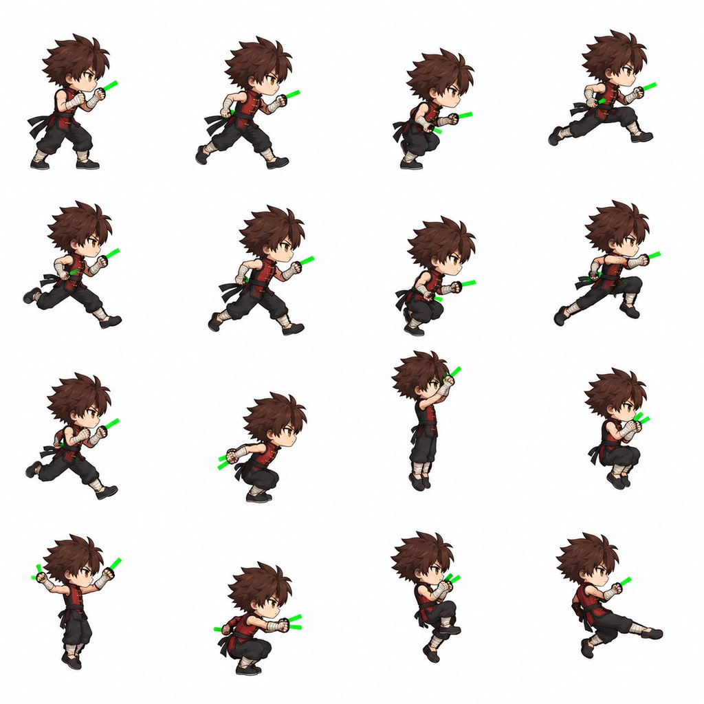
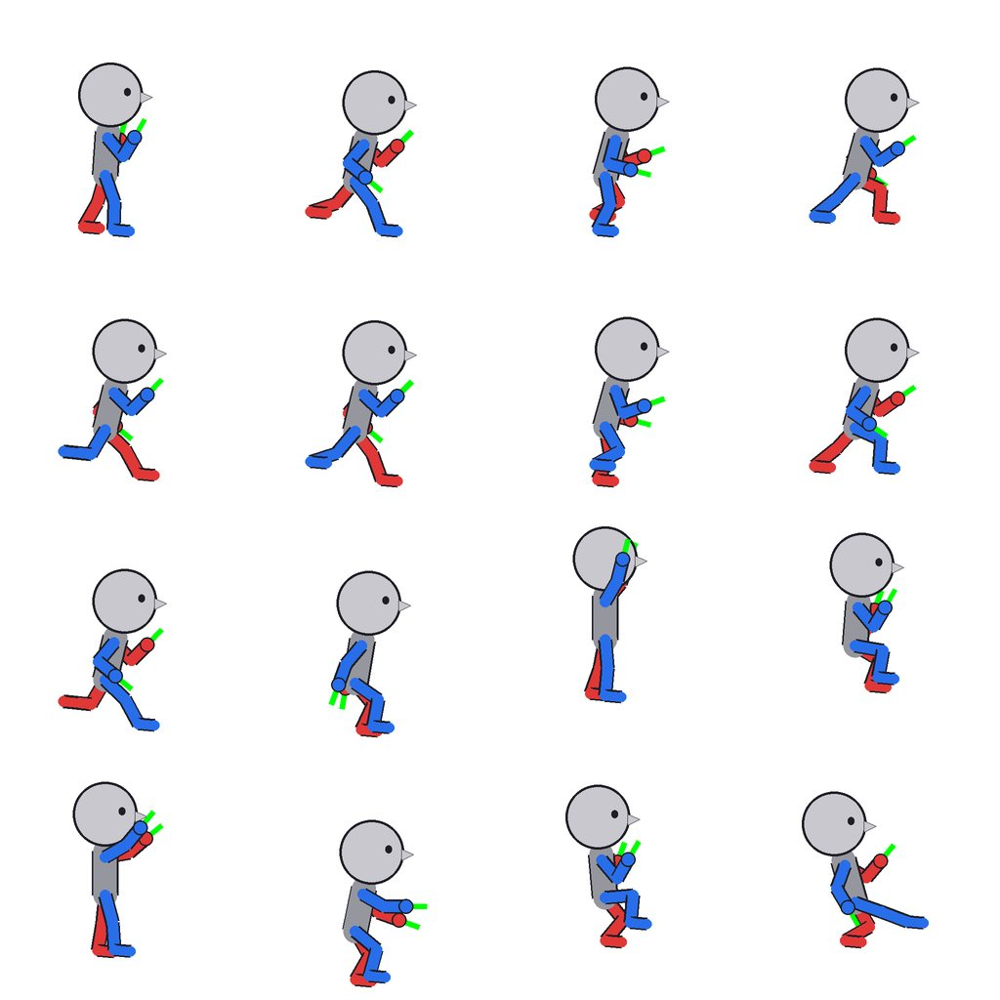
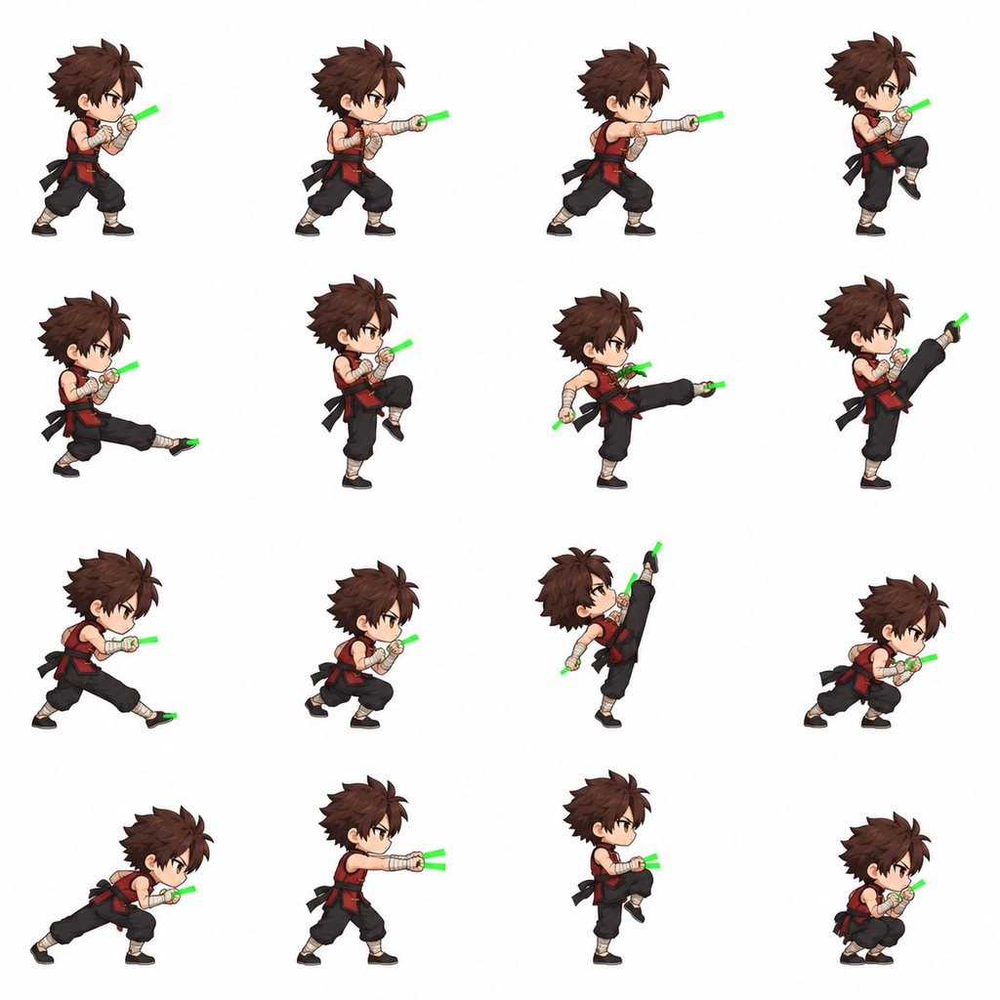
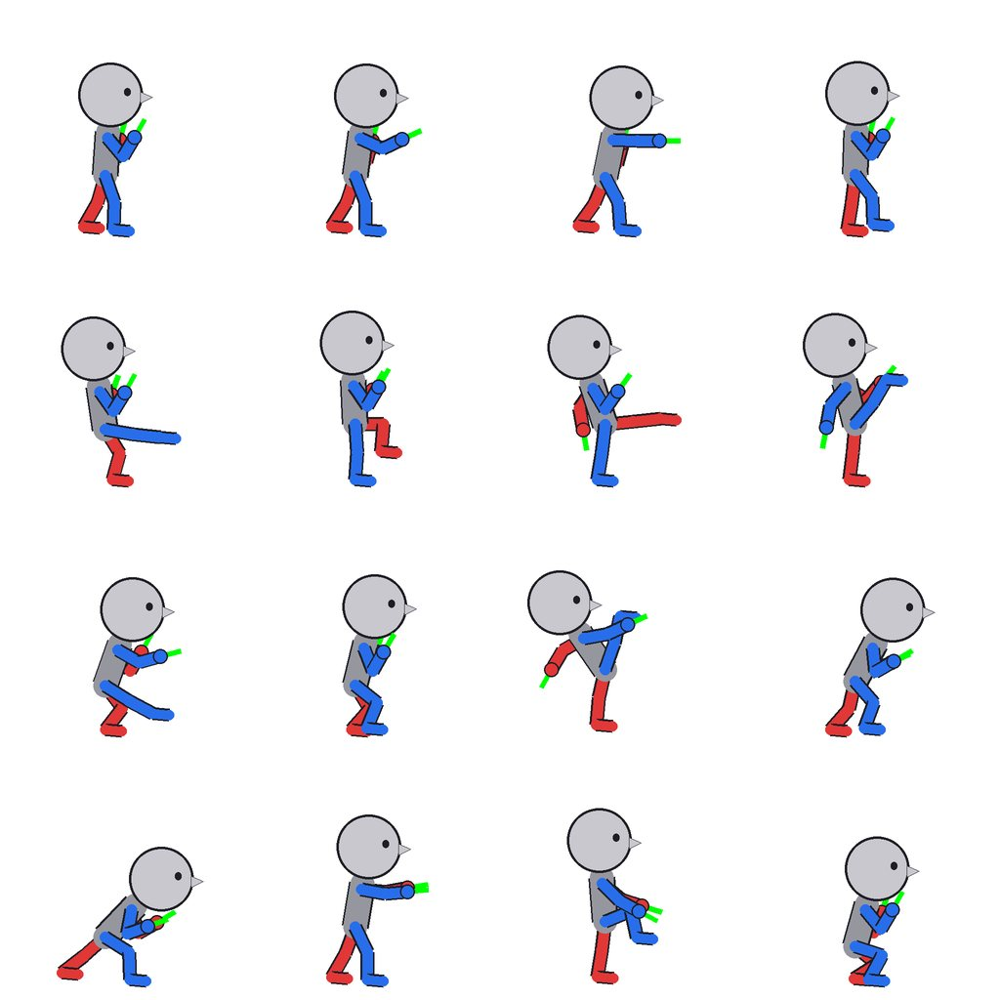

# 格斗家（男）原装帧 · 样图（B1 第一阶段）

> 2026-09-30。计划见 docs/CLASS_PLAN_FIGHTER.md §3（美术）/ §4 B1。这一阶段只做**设计定稿 + 4×4 样表**，放进游戏截图给主线程审；全套动作表等“go”再出。
> 审图只看一张：`art/work/fighter_samples/overview.jpg`（设计三视图 → 切好的 31 帧和锚点 → 游戏内和鬼剑士并排：站立 / 跑 / 普攻 4 段）。

## 1. 结论
- **推荐用 4×4 表（16 格 = 站姿参考 + 15 帧）+ 每格姿势参考小人 + 拳上直接画绿色占位棒，一次出图**，不回退老流水线：两张 16 格表人物前后一致（脸、发型、衣服、比例两张表之间也一致），按格切帧 16/16、15/15 一次切对，头部锚点 31/31、混搭分割线 31/31。
- 生图实测 **4 次**（原装立绘 1、三视图 1、4×4 表 2），0 失败、0 重试。这 31 帧如果走老流水线 = 3×3 表 4 张 + 占位武器轮 4 张 = 8 次；全套约 110 帧：4×4 约 8 张 vs 老流水线 14 + 14 = 28 张。
- 比例：站姿参考格定 `HEIGHT = 112`（鬼剑士 118；格斗架势膝盖微弯、头发更炸，112 时头和身体和鬼剑士看起来一样大，见 `engine_idle.jpg`）。只是一个常数，改了重切即可，不用重新生图。
- 批量前要改的两处（都不用重出设计）：跑步 run2 / run6 蹲得太深（头部上下起伏偏大，§4-6）；远侧拳锚点覆盖不够（§4-3）。

## 2. 设计定稿
| 项 | 定稿 |
|---|---|
| 参考 | 按鬼剑士原装立绘（`art/src/sword_ref.png`）的 Q 版比例 / 描边 / 上色生成，同画幅同朝向 |
| 发型 | 深栗棕色刺猬短发，琥珀色眼睛；**不戴头带 / 帽子**（转职靠发色 + 头饰区分，JOB_VISUALS §5；栗棕色和红 / 黑衣服色相分得开，转职染发好找） |
| 衣服（新手默认） | 无袖暗红功夫马甲（黑色立领、黑边、金色盘扣）、黑色腰带（两条短飘带）、黑色灯笼练功裤、米色绑腿、黑布鞋；**双拳和前臂缠米色绑带（空拳）** |
| 站姿 | 轻快的格斗架势（脚尖着地、膝盖微弯、双拳护在胸前 / 下巴） |
| 图 | 设计三视图（正面 / 3/4 / 侧面）+ 原装立绘：`art/work/fighter_samples/design.jpg`；选角立绘 `art/final/class/fighter.webp`（原装立绘去白底，不另生图） |


## 3. 样表做法（`art/tools/fighter_art.py`）
1. **姿势参考小人**（`guides`，poseguide 同一套画法、4×4 每格 512）：蓝 = 近侧手脚、红 = 远侧；每只拳头画一根沿前臂方向、从指节伸出的绿棒（D5 双手锚点）。跑步按 ANIMATION.md §5：长步幅，第 3、7 帧是真正的腾空帧（前后腿大开）。
   - 顺手发现：`poseguide.py` 的 `lean` 符号是反的（`180 + lean`，正值实际是**往后仰**），三职业的走 / 跑参考图都是后仰的小人（模型自己画成了前倾）。fighter_art.py 用自己的 `180 - lean`，没改 poseguide。
2. **4×4 动作表**（`sheets`）：参考图 = 原装立绘 + 姿势小人，提示词逐格写动作；两张表：
   - `move`：idle、run1~8、jump1~5、f_jkick1~2
   - `combo`：（站姿参考）f_jab1/2、f_low1/2、f_mid1/2、f_axe1/2、f_high1/2、f_shoulder1/2、f_grab、f_knee、f_crouch
3. **切帧**（`frames`）：复用 avatar_frames（抠绿棒 + 补色 + 握点 / 拳头轮廓 → `wpn` / `wpn2`）、avatar_head、avatar_cuts；fighter 自己换掉的部分：
   - `cut16`：3×3 → 4×4，按中心落在哪一格排序；
   - `stick_groups`：avatar_frames 会把共线的几段合成一根（刀被拳头隔开的情况），格斗家两只拳头的短棒常常平行，会被连成一根长棍 → 只合并首尾几乎挨着的两段；
   - `fist_sticks`：踢腿帧生图会在**脚尖**也画一截绿棒 → 按这一格的姿势小人（外框归一化）把每根棒和“近侧拳 / 远侧拳 / 近侧脚尖 / 远侧脚尖”做一一对应（总距离最小），对到脚尖的丢掉（绿色像素照样抠掉）；
   - `clean_frames`：原装没有白 / 绿衣物 → 被围住的白底（下巴和拳头之间、腰带飘带之间，外圈是深色描边、≥150 像素，眼睛高光留着）挖掉；绿色偏色压回。
4. 游戏内连拍（`node art/tools/fighter_shots.mjs`）：测试房间 `?fighter=1`，左边一个鬼剑士，两人同一套输入。

| 原表 | 姿势小人 |
|---|---|
|  |  |
|  |  |

## 4. 结果（量出来的）
| 项 | 结果 |
|---|---|
| 一致性 | 两张表 31 帧同一个人（脸 / 发型 / 服装 / 绑带 / 比例），表与表之间一致；姿势基本照着小人（腿用哪条、踢多高都对） |
| 切帧 | 16/16、15/15 按格切对，0 手工修正（`avatar_fix.json` 没加条目）；帧约 122×202（站姿）~185×217，res 1.8，共 344 KB |
| 头部锚点 / 分割线 | 31/31 / 31/31 |
| 拳头锚点（`wpn` / `wpn2`，全部带握拳轮廓） | 39 只拳：两只拳都有 9 帧、一只 21 帧、没有 1 帧（f_axe1）；丢掉脚尖上的棒 7 根（5 个踢腿帧 + jump4 / jump5） |
| 游戏内 | `SpriteModel`，31 帧；站立 / 双击跑 / 普攻 4 段（快拳 → 下段踢 → 中段踢 → 下劈，按 B0 的连招窗口连得上）/ 跳 + 空中踢都换帧正确，0 报错 |
| 动作手感（`WEB=1 node test/animfeel.mjs fighter`） | 跑：每帧停 3 步（CV 0）、**步幅匹配 0.675**（三职业改后 0.57~0.66，更好）；**头部上下 10.9、每步最大跳 8.0**（鬼剑士改后 3.2）；普攻 1 头部跳 8.8（= 鬼剑士改后）；跑攻肩撞 23.7（换帧缓动收得住） |


**问题和批量时的处理**
1. 脚尖绿棒：已自动丢掉；提示词加了“脚上永远没有绿色”（下一批验证）。
2. 平行短棒被连成一根：已换 grouping。
3. **远侧拳锚点不够**：远侧拳被身体挡住的帧本来就不用画武器，但也有露在外面、模型没画棒的（例：idle、f_jab2 的后手）。批量时提示词强调“两只拳都要有棒，哪怕只露一截”；B2 的 cover 模式另加兜底：没有锚点的拳按绑带颜色找（avatar_hands.py 的做法，限定在腰线以上）。
4. 白底口袋 / 绿边：已清；腰带飘带之间偶尔剩 1 像素白丝（1 倍下看不出）。
5. f_mid2 胸前那只拳：绿棒横穿胸口，补色后拳头有点糊 → 批量时单格返修（`avatar_gen.touch` 的做法）或整张重出时顺带。
6. **跑步起伏偏大**：run2 / run6（重心落在弯曲的腿上）蹲太深，头比腾空帧低 17.6（鬼剑士整圈约 7）。批量时把这两个小人的膝盖少弯一点、腾空帧 lift 26 → 18，move 表重出 1 次。
7. 走路帧这版没做（walk 暂时用 idle 兜底），跟通用骨架表一起出。
8. `test/fighter.mjs smoke`（B0 的文件）断言“建出来的格斗家是矢量占位模型”（`town.model !== 'SpriteModel'`，第 213 行）：有了原装帧以后这项会失败，属于预期变化，要负责人把这个条件去掉（其余 feel / switch / smoke 全过）。

## 5. 下一步（等主线程“go”）
1. 按 §3.2 姿势表定全套：通用骨架（walk 8、hit1~3、air / airUp / tumble / bounce / down / getup / tech / held / roll / charge / victory）+ 普攻共用姿势余下的（旋转踢、下踏、俯冲、飞踢、推掌、蓄气、结印、跺地、砸地、举起 / 背摔）+ 4 个转职的专属姿势 + 起手 / 收招帧，约 110 帧 → 4×4 约 7~8 张（move 表重出 1 张含跑步修正）。
2. 每张先出参考小人自己看一眼 → 2 路并发生图 → `frames` → `review` → 主线程看 overview。
3. 职业插图 `cutin/fighter`（1 次）。

## 6. 命令
```
python3 art/tools/fighter_art.py guides | ref | design | sheets [--only 表] | frames [表...] [--dry] | class | review
node build.mjs --offline && node art/tools/fighter_shots.mjs        # 游戏内连拍 → art/work/fighter_samples/engine_*.jpg
node build.mjs --web && WEB=1 node test/animfeel.mjs fighter <名>   # 走 / 跑 / 普攻手感指标
```
原图在主仓库 `art/src/fighter_ref.png`、`art/src/fighter/`（design、guide_*、sheets/、cut/ 切帧预览），不进 git。
