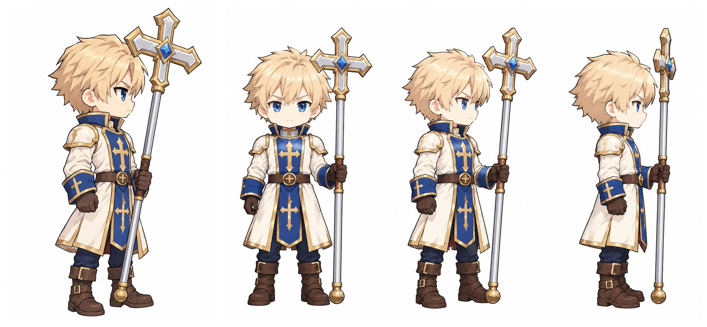

# 男圣职者（priest）原装美术

> 2026-10-01。第一阶段：设计定稿 + 1 张 4×4 样表（本文 §2~§5）。**等主线程审过再出全套**（§7）。
> 审图只看一张：`art/work/priest_samples/overview.jpg`（设计 → 姿势小人和样表 → 16 帧和锚点 → 占位十字架拿在手里 → 和鬼剑士 / 格斗家并排 1 倍、4 倍 → 指标）。
> 做法照搬格斗家（docs/FIGHTER_ART_SAMPLES.md），工具 `art/tools/priest_art.py`。

## 1. 结论
- **生图 3 次、0 失败 0 重试**（原装立绘 1、三视图 1、4×4 样表 1；预算 4 次，剩 1 次没用）。
- 样表 16 格一次切对：**16/16 帧都有武器锚点（方向都对）、16/16 头部锚点、16/16 分割线**；动作格的头 / idle 的头 = 0.98（不用第二遍放大）。
- 比例 `HEIGHT = 118`（和鬼剑士同一把尺子：idle 头部中心离脚底 94.7，鬼剑士 94.3）。
- 走路是放松的日常步态（身体直立、远侧手臂自然前后摆，近侧手像拄手杖一样竖着拿十字架），不是战斗架势；跑步前倾、远侧手臂大幅摆、十字架拖在身后下方（同鬼剑士拖刀）。
- 已知问题：run7 的头比 run1 / 3 / 5 高 5~6（跑步头部起伏 6.1，和鬼剑士的 6.6 同级、比格斗家返修后的 2.0 大）→ 全套时跑步按 8 帧重画（§7）。

## 2. 设计定稿
| 项 | 定稿 |
|---|---|
| 参考 | 按鬼剑士原装立绘（`art/src/sword_ref.png`）的 Q 版比例 / 描边 / 上色生成，同画幅同朝向；头一样大，肩膀和胸更宽（高大、结实） |
| 发型 | 蜂蜜金色短发（整齐，头顶略翘），蓝眼睛；**不戴帽子 / 头盔 / 头带**（转职靠发色 + 头饰区分，JOB_VISUALS §5） |
| 衣服（新手默认） | 及膝高领长外套，**暖象牙白（奶油白，不是纯白）**，金边；宝蓝色立领和袖口；前襟宝蓝色长条挂饰带金色十字；小圆肩甲（象牙白 + 金边）；棕皮带 + 刻十字的圆形金扣；藏青长裤；棕色皮靴；棕色皮手套 |
| 武器（默认十字架） | 大型钝器十字架：银色长杆，下端棕色缠皮握把 + 金色圆头，上端大十字头（银 + 金边，中间一颗蓝宝石），全长约等于身高 |
| 站姿 | 平静直立，近侧手在腰前握住杆的下段、十字架竖着稍前倾（十字头在头顶前方），远侧手自然下垂 |
| 图 | `art/work/priest_samples/design.jpg`；选角立绘 `art/final/class/priest.webp`（原装立绘去白底，含十字架，高 420） |

- 象牙白而不是纯白：去白底按“近白 = 最小通道 ≥ 233 且色差 ≤ 14”判，纯白衣服会被当成背景挖掉。原装立绘实测浅色区域（衣服）中位色 (251, 239, 226)，不会被挖；只有十字架杆和脸之间围住的白底（约 3.4 万像素）会被 `fill_holes` 挖掉（选角立绘已处理）。
- 选角立绘按“含十字架的整体高 420”缩放，身体比鬼剑士的立绘小约 12%；要一样大就把十字头裁掉一截再缩放（主线程定）。



## 3. 做法（`art/tools/priest_art.py`，和格斗家的差别）
1. **姿势小人**（`guides`，4×4 每格 512，画法 / 比例 / 关节角度表同格斗家）：近侧手握一根纯绿占位棒 = 十字架的轴线（握点 → 尖端约半个身高，拳头握在下端、另一侧露出一小截握柄）；`two` = 远侧拳也握在同一根棒上（握在近侧拳下面，手臂用两节 IK 够过去）。每个小人连同棒子在格子里水平居中，伸出去的棒不进隔壁格。
   - 举过头的姿势（a1_1、a3_1）要把手拉到**头后面**：Q 版手臂短，手举直也够不到头顶，棒子会横穿脸（第一版小人就是这样，改成上臂往后、棒子指向后上方）。
2. **一次出表**（`sheets`）：参考图 = 原装立绘 + 姿势小人；提示词写明“这张表里不画十字架，由绿棒代替整把武器”（没画出十字头，16 格都有棒）。不再跑“武器换成占位棒”的改图（鬼剑士 / 魔法师的老流程每张表多 1 次生图）。
3. **切帧**（`frames`）：`avatar_frames` 原样（去白底 → 按连通块切格 → 抠占位棒 + 补色 → 握点 / 方向 / 身前身后 / 握拳轮廓），只把 3×3 换成格斗家的 `cut16`；棒子分组用 avatar_frames 默认的“共线合并”（一把武器，不用格斗家两只拳各一根的分组）。额外两步：
   - `FT.clean_frames`：被围住的白底块（外圈是深色描边）挖掉，这张表挖了 5 块，象牙白衣服没被误伤；
   - `deteal`：握点附近的青色残留（绿棒和手套阴影混出来的，样表每帧 ≤42 像素）按亮度改成手套棕色，共 744 像素（2048 原图像素）。
   - 比例两遍、头部锚点、分割线同格斗家。
4. **体检**（`check`）：离线按 `test/animfeel.mjs` 的口径算走 / 跑的头部跳动、起伏和步幅（priest 还没进游戏），三个职业都只取 1/3/5/7 四帧，同口径对比；闪烁 / 头部比例 / 表内逐格同格斗家。
5. **审图**（`review`）：占位十字架按锚点画在手里（身后的画在帧前面，身前的画在帧后面再把握拳轮廓盖回去，同运行时 `avatar.js` 的顺序），长度 0.8 个身高，只用来看握法，正式武器图另做。

## 4. 样表的帧（`art/src/priest/sheets/priest_sample.png`，第 1 格 idle 是站姿参考）
| 格 | 帧 | 动作 | 武器锚点（握点→尖端角度，图像坐标 y 朝下；前 = 画在身前） |
|---|---|---|---|
| 1 | idle | 站立，十字架竖在身前稍前倾 | -72°（朝上偏前），前 |
| 2~5 | walk1 / 3 / 5 / 7 | 放松走路（8 帧循环的 0° / 90° / 180° / 270° 相位），远侧手臂 ±26° 摆 | -71° ~ -75°，前 |
| 6~9 | run1 / 3 / 5 / 7 | 跑（腿同格斗家 run1/3/5/7：长步幅，3、7 是低腾空帧），十字架拖在身后下方 | 147° ~ 153°（朝后下），前 |
| 10~12 | a1_1 / a1_2 / a1_3 | 普攻 1：举到头后 → 平挥向前 → 砸到身前地面 | -142° / -3° / 38°，前 |
| 13~15 | a2_1 / a2_2 / a2_3 | 普攻 2：低位后摆 → 向前上撩 → 竖举在身前 | 144° / -30° / -75°，前 |
| 16 | a3_1 | 普攻 3 起手：双手握杆举到头后（测双手握的锚点） | -141°，前 |

- 每帧 `wpn = { gx, gy, ang, len, bk, front, hand }`（字段同鬼剑士），没有 `wpn2`；握拳轮廓每帧 1 个（a3_1 远侧拳在杆后面，被杆挡住，运行时只盖近侧拳，和真实遮挡一致）。
- `head` 16/16（其中 a2_2 标了 `f: 0` 脸被挡住 → 这一帧不画眼镜类配件）、`cut` 16/16。


## 5. 体检（`check.json`；世界单位；走 / 跑三个职业都取 1/3/5/7 四帧）
| 项 | 圣职者 | 鬼剑士 | 格斗家 |
|---|---|---|---|
| 走：头部每帧最大跳 / 平均 / 起伏 | 1.69 / 1.49 / 1.50 | 1.47 / 1.23 / 1.33 | 3.67 / 2.09 / 3.67 |
| 走：步幅匹配（1 = 脚钉在地上） | 0.75 | 0.47（8 帧 1.00） | 0.76（8 帧 0.76） |
| 跑：头部每帧最大跳 / 起伏 | 6.18 / 6.11（run7 高 5~6） | 7.28 / 6.61 | 2.26 / 2.00 |
| 跑：步幅匹配 | 4 帧里着地帧和腾空帧交替，量不到（格斗家 4 帧同样是 0） | | |
| 衣服闪烁（avatar_flicker 离群分）walk / run | 0.068 / 0.063 | 0.144 / 0.063 | 0.179 / 0.093 |
| 表内逐格直方图差（同一动作的相邻格） | 走 0.063~0.079，跑 0.070~0.092，普攻 0.060~0.091 | 0.07~0.15（整表） | 0.10~0.17（整表） |
| 头部比例（每帧对 idle，偏差中位；>12% 的帧） | 0.02；无（16/16 可信） | 0.02；无 | 0.02；bounce、fg_press |
| idle 大小（高 × 宽） | 117.8 × 55.0 | 117.8 × 66.1（含围巾） | 111.1 × 61.1 |

- 离线口径的可信度：同样的算法量鬼剑士 8 帧走路步幅 1.00、格斗家 0.76，游戏内 animfeel 是 1.14 / 0.83（游戏里还有循环起伏修正 `sprLoopNorm` 和换帧缓动，会更小）。
- 占位十字架（0.8 个身高）在 a1_3 和跑步里尖端碰到地面：正式武器的大小在武器图那一步定（`avatar_weapons.py` 的 `HAND`）。

## 6. §clips：动作片段和帧名（给 P-core 写 `SPR_ANIMS.priest`）
片段名和鬼剑士 / 格斗家的基础套一致；帧名：通用动作同鬼剑士（`idle`、`walk1~8`、`run1~8`、`jump1~5`、`hit1~3`…），普攻 `a<段>_<帧>`，圣职者基础技能用 `p_` 前缀，转职专属以后用 `pc_`（圣骑士）/ `pm_`（蓝拳）/ `pe_`（驱魔）/ `pa_`（复仇者），不互相覆盖。写法建议照格斗家用 `sprTl` 兜底（帧没出齐时自动回退到 idle），出一批帧自动换上。

| 片段 | 帧（[帧, 起始秒]；循环写 fps） | 用途 | 状态 |
|---|---|---|---|
| idle | idle | 站立 | **样表已有** |
| walk | walk1~8，12 fps，`v` = 移速 | 走 | 样表有 1/3/5/7；全套 8 帧重画 |
| run | run1~8，20 fps，`v` = 跑速 | 跑 | 样表有 1/3/5/7；全套 8 帧重画 |
| jumpUp / jumpFall / land / back | jump2 / [jump3, jump4 @0.12] / jump5 / jump4 | 跳（同 BASE_ANIMS） | 全套 |
| hit / hit2 | [hit1, hit2 @0.1] / [hit2, hit3 @0.05] | 受击 | 全套 |
| airUp / air / bounceUp / down / getup / tech / held / charge / roll | 同 BASE_ANIMS（airUp、tumble、air、bounce、down、getup、tech、held、charge、roll） | 浮空、倒地、起身、被抓、蓄力、翻滚 | 全套 |
| atk1 | [a1_1, 0], [a1_2, 0.05], [a1_3, 0.12] | 普攻 1：举到头后下劈 | **样表已有** |
| atk2 | [a2_1, 0], [a2_2, 0.05], [a2_3, 0.14] | 普攻 2：反手上撩 | **样表已有** |
| atk3 | [a3_1, 0], [a3_2, 0.12] | 普攻 3：双手举过头砸地（a3_2 = 砸到地面） | a3_1 已有，a3_2 全套 |
| dash | [dash1, 0], [dash2, 0.06] | 跑攻：十字架横在身前冲撞 | 全套 |
| jatk | [jatk1, 0], [jatk2, 0.06] | 空中攻击：空中下劈 | 全套 |
| up | [p_up1, 0], [p_up2, 0.09] | 空斩打：低蹲 → 十字架向上挑（浮空） | 全套 |
| jab | { fps 14: p_jab1, p_jab2 }，末击 jabEnd [p_jabEnd, 0] | 直拳冲击：空着的远侧拳连续直拳，末击重拳击飞 | 全套 |
| hook | [p_hookDash, 0], [p_hook, 0.1] | 勾拳追击：前冲 → 上勾拳 | 全套 |
| tiger | [p_grab, 0], [p_tiger, 0.2] | 虎袭：空手抓住前方 → 拖着冲 | 全套 |
| slamJump / slamLand | [p_slamUp, 0] / [p_slamDown, 0] | 落凤锤：跳起双手举十字架 → 砸地 | 全套 |
| pray | [p_pray1, 0], [p_pray2, 0.15] | 缓慢愈合 / 净化 / 化魔 / 自身 BUFF：双手把十字架举在胸前祈祷 | 全套 |
| bless | [p_bless, 0] | 武器祝福 / 天使祝福（对单个目标）：空着的手向前张开施术 | 全套 |
| demonhand | [p_hand1, 0], [p_hand2, 0.2] | 恶魔之手：空手举起 → 按向地面 | 全套 |
| guard | [p_guard, 0] | 格挡 / 防御姿势：十字架横在身前 | 全套 |
| focus | [p_focus, 0] | 通用施法（圣光球等投射物）：十字架指向前方 | 全套 |

- 老骨架（`src/content/classes/priest.js`，priest/wip 分支）用到的片段 `atk1 / atk2 / atk3 / dash / jatk / up / palm / a3slam / focus / guard`：`palm` 换成 `jab`，`a3slam` 换成 `slamJump` + `slamLand`，其余同名。
- 片段时间点是按鬼剑士同类动作写的建议值，P-core 按技能 `dur` 调；帧名定了就不改。

## 7. 全套计划（等审过再做）
| 表（4×4，第 1 格站姿参考） | 帧 |
|---|---|
| move | idle 参考、run1~8（按格斗家返修后的跑步：头整圈一样高）、jump1~5、jatk1 / jatk2 |
| walk | 放松站直参考、walk1~8、walk1~7 备份（格斗家 §8 的做法） |
| react | hit1~3、airUp、tumble、air、bounce、down、getup、tech、held、charge、roll、victory、a3_2 |
| skills | dash1 / dash2、p_up1 / p_up2、p_jab1 / p_jab2 / p_jabEnd、p_hookDash / p_hook、p_grab / p_tiger、p_slamUp / p_slamDown、p_pray1 / p_pray2 |
| skills2 | p_bless、p_hand1 / p_hand2、p_guard、p_focus（空格留给单格返修） |
- 预计 5 次 + 返修 2~3 次；样表的 idle / a1 / a2 / a3_1 保留，walk / run 由新表整圈替换（一圈只出自一张表，避免逐帧闪）。
- 之后：武器图（十字架及其余 4 类武器，`weapon_gen.py`）、6 套时装、转职头饰和转职专属姿势按各自流程。

## 8. 生图记录（3 次，全部 sunburst，0 失败 0 重试，串行 1 路）
| 次 | 内容 | 尺寸 | 耗时 | 结果 |
|---|---|---|---|---|
| 1 | 原装立绘（参考鬼剑士立绘） | 1024×1536 | 66 秒 | 用 |
| 2 | 三视图（参考原装立绘） | 1536×1024 | 51 秒 | 用 |
| 3 | 4×4 样表（原装立绘 + 姿势小人） | 2048×2048 | 82 秒 | 用，16 格一次过 |

## 9. 命令
```
python3 art/tools/priest_art.py guides | ref | design | sheets [--only 表] [--force] | frames [表...] [--dry] | check | class | review
```
原图在主仓库 `art/src/priest_ref.png`、`art/src/priest/`（design、guide_*、sheets/、cut/ 切帧预览），不进 git。
