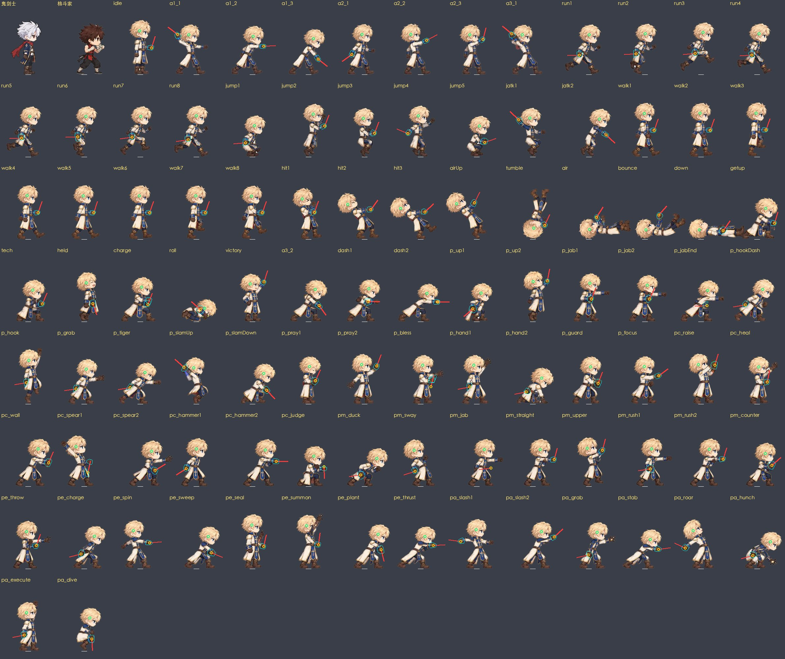
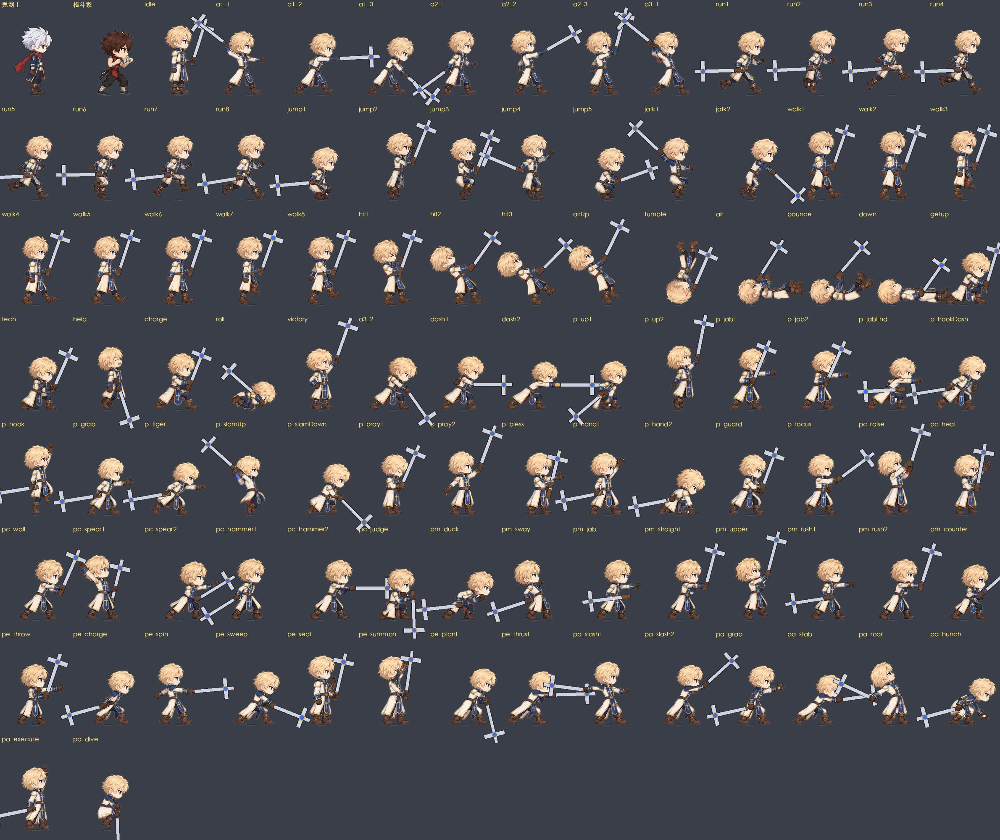
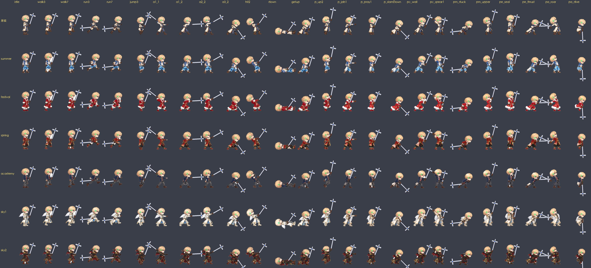

# 男圣职者（priest）原装美术 + 时装

> 2026-10-01。第一阶段样图（设计 + 1 张 4×4 样表）主线程已审过（设计、放松走路、比例、锚点都通过）；第二阶段按审图意见出全套：
> 原装 98 帧（基础片段 + 基础技能 `p_` + 四个转职姿势 `pc_ / pm_ / pe_ / pa_`）、跑步整圈 8 帧重画、6 套商城时装、选角立绘按身体和鬼剑士同高。
> 审图只看一张：`art/work/priest_samples/overview.jpg`。工具 `art/tools/priest_art.py`，做法照搬格斗家（docs/FIGHTER_ART_SAMPLES.md）。

## 1. 结论
- **原装 98 帧**（7 张 4×4 表：样表 1 + 全套 6）：**98/98 帧都有武器锚点（全部画在身前）、98/98 头部锚点、97/98 分割线**（roll 缩成一团不写，同格斗家）；动作格的头 / idle 的头 0.94~1.02（自动归一），头部比例偏差中位 0.02（96/98 帧可信，没有 >12% 的帧）。
- **6 套时装 × 98 帧 = 588 帧**，锚点从原装平移过来（§5）。
- **生图：第二阶段 18 次**（原装 6 + 时装 12），0 失败；预算 20，剩 2。第一阶段 3 次，累计 21 次（格斗家做同样的量：原装 19 + 时装 42 次）。
- 走：游戏里（循环起伏修正之后）头部每帧最大跳 0.28、起伏 0.31（鬼剑士 0.48 / 0.78）。跑（8 帧重画）：最大跳 1.56、起伏 2.53（主线程要求 ≤ ~3；鬼剑士 3.24 / 5.75，格斗家 0.91 / 1.28）。
- 十字架按 0.7 个身高：跑步 8 帧最低点离地 ≥ 9.4（不擦地）；砸地类帧（a1_3、a3_2、p_slamDown、pe_plant、pa_dive）碰地是故意的。
- 选角立绘 `art/final/class/priest.webp`：按身体（头顶 → 脚底）缩到 420 高，和鬼剑士 / 格斗家一样大，十字架顶端出框。
- 还没进游戏验：P-core 的开关（`SPR_ANIMS.priest`）还没合进 main，本文的指标都是离线算的（和 test/animfeel.mjs 同算法，用鬼剑士 / 格斗家对过：算出来和它们游戏内的值一模一样，§6）。

## 2. 设计定稿（第一阶段，已审）
| 项 | 定稿 |
|---|---|
| 参考 | 按鬼剑士原装立绘（`art/src/sword_ref.png`）的 Q 版比例 / 描边 / 上色生成；头一样大，肩膀和胸更宽 |
| 发型 | 蜂蜜金色短发，蓝眼睛；不戴帽子 / 头盔 / 头带（转职靠发色 + 头饰区分，JOB_VISUALS §5） |
| 衣服（新手默认） | 及膝高领长外套，**暖象牙白（不是纯白，去白底不会被挖）**，金边；宝蓝立领和袖口；前襟宝蓝长条挂饰带金十字；小圆肩甲；棕皮带 + 十字圆金扣；藏青长裤；棕皮靴；棕皮手套 |
| 武器（默认十字架） | 大型钝器十字架：银色长杆，下端棕色缠皮握把 + 金色圆头，上端大十字头（银 + 金边 + 蓝宝石） |
| 图 | `art/work/priest_samples/design.jpg`（原装立绘 + 三视图 + 三职业选角立绘） |

## 3. 做法（`art/tools/priest_art.py`）
1. **姿势小人**（`guides`，4×4，画法 / 比例同格斗家，蓝 = 近侧、红 = 远侧）：近侧手握一根纯绿占位棒 = 十字架轴线（拳头握在下端，另一侧露出一小截握柄）；`two` = 远侧拳也握在棒上（手臂两节 IK 够过去）；`fo` = 远侧手张开（三根手指）。
   - **棒子别横穿脸**：Q 版手臂短，手举过头也到不了头顶。`face_gap` 量棒子离头 / 鼻尖的距离，`clear_face` 把竖在身前的棒往前倾到够远（头 ≥ 14、鼻尖 ≥ 26 像素，最多前倾 48°）；手本来就在脸前的“举高”姿势（victory、p_up2、p_pray2、pc_raise、pm_upper）改成手往前伸。
   - 跑步：腿和远侧手臂 = 格斗家返修后的 run1~8（头整圈差不多一样高）；近侧手在胯旁，棒子画成水平拖在身后（生图会画得比小人斜 10~15°，样表按“斜向后下”画出来尖端离地只剩 3.5）。
2. **一次出表**（`sheets`，每张 1 次生图，串行）：参考图 = 原装立绘 + 姿势小人；提示词写明“这张表里不画十字架，由绿棒代替整把武器”。
3. **黄绿棒刷回纯绿**（`regreen`）：祈祷 / 祝福类的格子，生图会把棒画成黄绿渐变（“圣光”），切帧只认纯绿 → 没锚点、黄棒留在帧里。按格用纯绿偏色的像素拟合棒的轴线，只刷轴线两侧半个棒宽之内、颜色像棒、和种子连着的像素（金边 / 金发离轴线远不会被刷），原图备份在 `sheets/_pre/<表>_raw.png`。原装 7 张表刷了 21 格（skills 的 p_pray1 / p_bless / pc_raise / pc_heal / p_slamDown 是真的黄了；run / jump1 / a1_1 这些只是绿得不够纯，刷完更稳）；逐像素对比过，改动都在棒上。
4. **切帧**（`frames`）：`avatar_frames` 原样 + 格斗家的 `cut16`；额外 `FT.clean_frames`（被围住的白底块）、`deteal`（握点附近的青色残留改成手套棕）。比例两遍、头部锚点、分割线同格斗家。
   - 手工修正 `FIX`（逐帧看过切帧预览）：跑步 / 起跳 / p_jabEnd / pm_jab 的棒子水平拖在身后、穿过外套下摆被判成“身后”→ 统一 `front: 1`（不然一圈里十字架在腿前 / 腿后乱跳）；p_bless 的棒顶挨着张开的手，尖端认反 → `flip`；pc_judge 的棒被膝盖挡成两段不共线 → `one`。
5. **选角立绘**（`class`）：原装立绘去白底，头顶取人物外框左半边最高的不透明像素（十字头在右边、和头发连着，连通块分不开），头顶 → 脚底缩到 420。
6. **时装**（`ccomposite` → `csheets` → `cframes`，§5）。
7. **体检**（`check`）+ **审图**（`review`，含 `creview` 时装对照）。

## 4. 原装的帧（`art/src/priest/sheets/priest_<表>.png`，第 1 格都是站姿参考）
| 表 | 帧 |
|---|---|
| sample（第一阶段，已审；walk / run 格已被下面整圈替换，不再切） | idle、a1_1~3、a2_1~3、a3_1 |
| move | run1~8、jump1~5、jatk1 / jatk2 |
| walkreact | walk1~8、hit1~3、airUp、tumble、air、bounce |
| base | down、getup、tech、held、charge、roll、victory、a3_2、dash1 / dash2、p_up1 / p_up2、p_jab1 / p_jab2 / p_jabEnd |
| skills | p_hookDash / p_hook、p_grab / p_tiger、p_slamUp / p_slamDown、p_pray1 / p_pray2、p_bless、p_hand1 / p_hand2、p_guard、p_focus、pc_raise、pc_heal |
| jobs1 | pc_wall、pc_spear1 / pc_spear2、pc_hammer1 / pc_hammer2、pc_judge、pm_duck、pm_sway、pm_jab、pm_straight、pm_upper、pm_rush1 / pm_rush2、pm_counter、pe_throw |
| jobs2 | pe_charge、pe_spin、pe_sweep、pe_seal、pe_summon、pe_plant、pe_thrust、pa_slash1 / pa_slash2、pa_grab、pa_stab、pa_roar、pa_hunch、pa_execute、pa_dive |

- 每帧 `wpn = { gx, gy, ang, len, bk, front, hand }`（字段同鬼剑士，单手武器，没有 `wpn2`）；98 帧全部 `front: 1`，握拳轮廓 97 帧（pm_jab 没找到，运行时十字架会压住那只拳头一点）。
- `head` 98/98，其中 8 帧标了 `f: 0`（脸被挡住 / 转过去，不画眼镜类配件）：a2_2、p_pray1、pa_hunch、pa_slash2、pc_raise、pe_summon、pe_sweep、pe_thrust。




## 5. 时装（6 套 × 98 帧，`art/final/spr/priest@<套装>/`）
- 做法同格斗家 B2（原装带绿棒的表整张换衣服 → 切帧 → 按原装同名帧缩放 → 和原装轮廓对齐 → 锚点从原装平移），**省生图的两处**：
  1. 98 帧拼成 2 张 10×5 的大表（`ccomposite`：3840×2160，每格 384×432，原装格子统一缩放 0.75 / 0.81 后居中；A 表 = 移动 / 受击 / 普攻 50 帧，B 表 = 技能和转职姿势 48 帧 + 1 格 idle 当衣服参照）→ 一套 2 张图（格斗家一套 7 张）；
  2. 设计参考直接用鬼剑士同一套的参考立绘（`art/src/avatar/refs/sword@<套装>.png`），衣服描述用 `avatar_gen.SETS[套装]['sword']`，不另出圣职者时装立绘。保留棕手套（握拳轮廓和原装一致）。
- 切帧（`cframes`）：10×5 按连通块切（`cut_grid`，这张表几个人就切几块）→ 先刷黄绿棒 → 身体按“原装倍数 / 拼表缩放”放大 → `avatar_align.align` 和原装同名帧轮廓对齐（残差缩放 ±6%）→ `wpn / head / cut` 从原装平移过来。
- 切之前两步清理（`cframes` 里自动做）：① 黄绿棒刷回纯绿（同原装）；② **四边浅灰边刷白**：生图偶尔在整张表四边画一圈浅灰边（academy / sky1 的 B 表、festival 的 A 表），连成一个横跨整行的连通块被切进某一帧（那一帧宽 2395 像素、轮廓重合度掉到 0.36）；拼表时每格内容离格边 ≥ 15 像素，四边 14 像素刷白。
- **按格子切，不按“最大的 n 块”挑**（`cut_grid`）：一帧断成两大块时，按大小挑会把后面的帧名全部错开一位（第一版 academy / sky1 的 B 表就是这样，几十帧重合度 < 0.6）。
- **眼睛**：设计参考是鬼剑士（红眼睛），换装时眼睛常被画成红 / 红棕。`eyes_blue` 只改头部锚点前下方眼睛框里明显偏红（色相 ≤14 / ≥330）的像素 → 原装的蓝（第一版按 ≤30 改，把发际线的深棕描边刷成了蓝色，已撤）。sky1 / sky2 的红眼睛改掉了；festival / academy 部分帧是棕色眼睛（色相 17~27，和发际线描边分不开），没改（§6 已知问题）。

| 套装 | 帧 | 和原装轮廓重合度 最低 / 中位 | 衣服闪烁 walk / run | 清理 |
|---|---|---|---|---|
| summer 晴空海滩 | 98 | 0.63 / 0.87 | 0.113 / 0.140 | 黄绿棒 |
| festival 庆典 | 98 | 0.76 / 0.86 | 0.080 / 0.094 | 黄绿棒、A 表四边刷白、红眼睛 |
| spring 锦鲤贺岁 | 98 | 0.79 / 0.86 | 0.097 / 0.137 | 黄绿棒 |
| academy 星辉学院 | 98 | 0.76 / 0.86 | 0.097 / 0.103 | B 表四边刷白 |
| sky1 天穹圣翼（背后小羽翼画进帧里） | 98 | 0.71 / 0.79 | 0.104 / 0.105 | B 表四边刷白、红眼睛 |
| sky2 炎龙之魂（背后小龙翼画进帧里） | 98 | 0.67 / 0.75 | 0.081 / 0.116 | 红眼睛 |
- 588 帧全部有 `wpn / head`（从原装平移）；原装的 walk / run 闪烁 0.178 / 0.107，时装都在同一档或更低。



## 6. 体检（`check.json`；世界单位；走 / 跑一圈 8 帧）
| 项 | 圣职者 | 鬼剑士 | 格斗家 |
|---|---|---|---|
| 走：头部每帧最大跳 / 起伏（原始） | 0.63 / 1.44 | 1.59 / 1.33 | 2.57 / 3.67 |
| 走：游戏里循环起伏修正之后 | **0.28 / 0.31** | 0.48 / 0.78 | 1.08 / 1.28 |
| 走：步幅匹配（1 = 脚钉在地上） | 0.63（按移速 165 算） | 1.00 | 0.76 |
| 跑：头部每帧最大跳 / 起伏（原始） | 4.31 / 4.72 | 7.03 / 7.22 | 1.99 / 2.33 |
| 跑：游戏里修正之后 | **1.56 / 2.53** | 3.24 / 5.75 | 0.91 / 1.28 |
| 跑：步幅匹配 | 0.59 | 0.73 | 0.85 |
| 衣服闪烁（avatar_flicker 离群分）walk / run | 0.178 / 0.107 | 0.143 / 0.075 | 0.187 / 0.110 |
| 表内逐格直方图差（同一动作的相邻格） | 走 0.048~0.086，跑 0.062~0.115，跳 0.10~0.12 | 0.07~0.15 | 0.10~0.17 |
| 头部比例（每帧对 idle，偏差中位；>12% 的帧） | 0.02；无（96/98 可信） | 0.02；无 | 0.02；bounce、fg_press |
| idle 大小（高 × 宽） | 117.8 × 55.0 | 117.8 × 66.1（含围巾） | 111.1 × 61.1 |

- 离线口径可信：`loco` 里照 `imgmodel.js sprLoopNorm` 做了同样的修正（头部 y 拟合成均值 + 二次谐波，帧按 0.94~1.06 竖向缩放；x 留一半），算鬼剑士 / 格斗家的跑步得到 3.24 / 5.75、0.91 / 1.28，和 FIGHTER_ART_SAMPLES §5 里 animfeel 游戏内实测的值完全一样。
- 十字架（0.7 身高，`cross_low` 按 `draw_cross` 的形状算最低点）离地：run1~8 为 9.4~24.0，jump1 6.7，p_hookDash 8.6，p_tiger 7.3，p_jabEnd 12.8；pm_duck（蓝拳低身俯冲，身体压得很低）-0.6，十字架横杆刚好碰地。
- 步幅匹配偏低（0.63 / 0.59，脚会往前滑一点）：放松走路的步子本来就小，和魔法师（0.63）同级；P-core 定了移速后按 `v` 调走 / 跑的播放速度即可。

**已知问题（没修，写给主线程判断）**
1. 时装的眼睛颜色不完全统一：原装蓝眼睛；summer / spring / academy 大多是深蓝 / 深棕，festival / academy 有些帧是棕色，sky1 / sky2 的红眼睛已改蓝。1 倍下眼睛约 3 像素，4 倍能看出来。要统一得出圣职者自己的时装立绘当参考重出（每套 +1 次，重出 12 张表）。
2. pm_jab 没找到握拳轮廓：运行时十字架会压住那只拳头一点。
3. pm_duck（蓝拳低身俯冲）0.7 身高的十字架横杆碰地 0.6。
4. 8 帧标了脸被挡住（不画眼镜）：a2_2、p_pray1、pa_hunch、pa_slash2、pc_raise、pe_summon、pe_sweep、pe_thrust。
5. 还没在游戏里跑：等 P-core 的 `SPR_ANIMS.priest` 合进 main，跑 `WEB=1 node test/animfeel.mjs priest` 和游戏内连拍核对（本文指标是离线算的）。

## 7. §clips：动作片段和帧名（给 P-core 写 `SPR_ANIMS.priest`，帧已全部在 `SPR_DATA.priest`）
片段名和鬼剑士 / 格斗家的基础套一致；通用动作的帧名同鬼剑士（`idle`、`walk1~8`、`run1~8`、`jump1~5`、`hit1~3`…），普攻 `a<段>_<帧>`，基础技能 `p_`，转职 `pc_`（圣骑士）/ `pm_`（蓝拳）/ `pe_`（驱魔）/ `pa_`（复仇者）。时间点是建议值（按鬼剑士同类动作），P-core 按技能 `dur` 调；帧名定了就不改。

### 7.1 基础（BASE_ANIMS 同名）
| 片段 | 帧（[帧, 起始秒]；循环写 fps） |
|---|---|
| idle | idle |
| walk / run | walk1~8 12 fps、run1~8 20 fps（`v` = 移速 / 跑速，同其他职业的写法） |
| jumpUp / jumpFall / land / back | jump2 / [jump3, jump4 @0.12] / jump5 / jump4（jump1 = 起跳下蹲，备用） |
| hit / hit2 | [hit1, hit2 @0.1] / [hit2, hit3 @0.05] |
| airUp / air / bounceUp / down / getup / tech / held / charge / roll | 同 BASE_ANIMS（airUp、tumble、air、bounce、down、getup、tech、held、charge、roll） |
| victory | [victory, 0]（十字架举在身前、另一只手叉腰） |

### 7.2 普攻 / 跑攻 / 空中攻击
| 片段 | 帧 | 用途 |
|---|---|---|
| atk1 | [a1_1, 0], [a1_2, 0.05], [a1_3, 0.12] | 举到头后下劈 |
| atk2 | [a2_1, 0], [a2_2, 0.05], [a2_3, 0.14] | 反手上撩 |
| atk3 | [a3_1, 0], [a3_2, 0.12] | 双手举到头后 → 砸地 |
| dash | [dash1, 0], [dash2, 0.06] | 跑攻：十字架当长枪向前刺 |
| jatk | [jatk1, 0], [jatk2, 0.06] | 空中下劈 |

### 7.3 基础技能（SKILLS_OFFICIAL_priest.md §1.2）
| 片段 | 帧 | 技能 |
|---|---|---|
| up | [p_up1, 0], [p_up2, 0.09] | 空斩打：低蹲 → 向上挑 |
| jab / jabEnd | { fps 14: p_jab1, p_jab2 } / [p_jabEnd, 0] | 直拳冲击：左右直拳连打 → 末击重拳 |
| hook | [p_hookDash, 0], [p_hook, 0.1] | 勾拳追击：前冲 → 上勾拳 |
| tiger | [p_grab, 0], [p_tiger, 0.2] | 虎袭：抓住 → 拖着冲 |
| slamJump / slamLand | [p_slamUp, 0] / [p_slamDown, 0] | 落凤锤：跳起双手举 → 单膝砸地 |
| pray | [p_pray1, 0], [p_pray2, 0.15] | 缓慢愈合 / 净化 / 化魔 / 自身 BUFF：双手持十字架祈祷 → 高举 |
| bless | [p_bless, 0] | 武器祝福 / 天使祝福（对单个目标）：空手向前张开 |
| demonhand | [p_hand1, 0], [p_hand2, 0.2] | 恶魔之手：空手举起 → 按向地面 |
| guard | [p_guard, 0] | 格挡：双手把十字架竖在身前 |
| focus | [p_focus, 0] | 通用施法 / 圣光球：十字架指向前上方 |

### 7.4 转职姿势（`J.anims` 里用，每个转职 8 帧）
| 转职 | 帧（动作） |
|---|---|
| 圣骑士 pc_ | pc_raise（双手高举：荣誉祝福 / 天启之珠）、pc_heal（空手向前上张开：快速愈合 / 圣愈之风）、pc_wall（双手把十字架往前推：圣光沁盾）、pc_spear1 / pc_spear2（投矛：举到头后 / 扔出，矛运行时画）、pc_hammer1 / pc_hammer2（双手：低位后摆 / 腰高横扫，神罚之锤 / 忏悔之锤）、pc_judge（单膝跪地拄十字架低头：正义审判） |
| 蓝拳圣使 pm_ | pm_duck（俯冲：低身前冲）、pm_sway（摆动：后仰）、pm_jab（空手刺拳）、pm_straight（握十字架的手直拳）、pm_upper（上勾拳：俯冲翔拳 / 破坏之拳）、pm_rush1 / pm_rush2（左右连打：圣拳连击 / 破碎之拳，可循环）、pm_counter（双手斜持十字架防守：神圣反击） |
| 驱魔师 pe_ | pe_throw（空手甩出符：破魔符）、pe_charge（双手低位后拉蓄力：潜龙）、pe_spin（单手平伸：巨旋风）、pe_sweep（双手低扫：狂乱锤击）、pe_seal（空手结印：脉轮 / 压制符）、pe_summon（空手举向天：式神召唤）、pe_plant（双手往地里砸：断空锤击 / 升天阵）、pe_thrust（双手前刺：无双击 / 黄龙阵击） |
| 复仇者 pa_ | pa_slash1 / pa_slash2（镰刀：后拉 / 前上挥出，死亡切割）、pa_grab（空手爪：恶魔之握 / 黑暗之触）、pa_stab（低身突刺：复仇之刺）、pa_roar（双臂后展咆哮：黑暗咆哮 / 不朽战吼）、pa_hunch（弓身爪地：半魔化 / 魔化）、pa_execute（空手高举掐人：审判，被抓的敌人运行时画）、pa_dive（空中双手往下刺：末日浩劫） |
- 复仇者的镰刀、驱魔的念珠 / 图腾、圣骑士的战斧等都用同一条武器轨迹（`wpn`），换武器图即可；投出去的矛 / 符 / 飓风、被抓的敌人、光效都是运行时画的，帧里没有。
- 老骨架（`src/content/classes/priest.js`，priest/wip 分支）用到的片段：`palm` 换成 `jab`，`a3slam` 换成 `slamJump` + `slamLand`，其余同名。

## 8. 生图记录
| 阶段 | 次 | 内容 | 结果 |
|---|---|---|---|
| 1 | 3 | 原装立绘、三视图、4×4 样表 | 已审 |
| 2 | 6 | move、walkreact、base、skills、jobs1、jobs2（4×4，2048²） | 全部用；skills 4 格黄绿棒程序刷回 |
| 2 | 12 | 6 套时装 × A / B（10×5，3840×2160） | 全部用 |
| 合计 | 21 | 第二阶段 18 次（预算 20），0 失败 0 重试，同一时间只发 1 个请求 | |

## 9. 复盘（给 PLAYBOOK）
- **时装拼大表**：10×5 拼表（3840×2160）一张换 50 帧，姿势 / 占位棒都照原样画、轮廓对齐全部 ≥ 0.6；一套时装从 7 张图降到 2 张（格斗家做法的 1/3.5）。条件：原装格子统一缩放后每格 ≥ 380 像素（切出来的帧只要 ~210 像素高）。
- **离线算游戏内手感**：把 `sprLoopNorm` 的修正搬进离线指标后，新职业没进游戏也能量“游戏里”的头部起伏，和 animfeel 对得上。
- **Q 版拿长武器**：竖着拿在身前的棒子默认会横穿脸，先在小人上量 `face_gap` 再生图；举过头的动作要把手放到头后。
- **圣光类动作的占位棒会被画成黄绿色**：切帧前按轴线刷回纯绿（比单格返修省生图）。
- **大表先刷白四边、按格子切**：3840×2160 的表有 1/4 带一圈浅灰边；自己拼的表格子位置已知，按格归块比按大小挑稳。每套切完扫一遍“帧比原装大 35% 以上”的（`cframes` 之后的检查）。
- **时装参考用别的角色会带过来眼睛颜色**：衣服描述里写了“same face”也不够；要省生图就接受或只改明显的红，要统一就出本职业的时装立绘。

## 10. 命令
```
python3 art/tools/priest_art.py guides | ref | design | sheets [--only 表] [--force] | regreen [表...] | frames [表...] | class
python3 art/tools/priest_art.py ccomposite | csheets [套装/组,...] | cframes [套装,...] | creview
python3 art/tools/priest_art.py check | review
```
原图在主仓库 `art/src/priest_ref.png`、`art/src/priest/`（design、guide_*、sheets/（`_pre/` 是刷绿前的原图）、costume/（拼好的原装大表 + 缩放缓存）、cut/ 切帧预览）、`art/src/avatar/sets/<套装>/priest_{A,B}.png`，不进 git。
