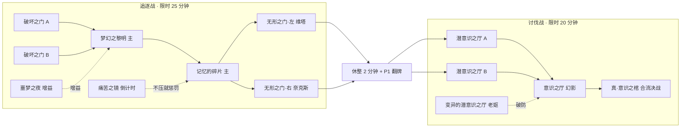

# 团本规划（RAID_PLAN）

> 2026-10-01 · 规划基线；RA1、RA2 和 RA3 的节点地图 / 团本货币已接入，RA4 融合装备与 RA5 美术仍待实现。
> 2026-10-08 · 希洛克团本按官方规则重做（官方全图、跨图规则、共享血量、合并），现行规则和来源以 [`RAID_SIROCO.md`](RAID_SIROCO.md) 为准；本文 §3.2 的“两人版流程（8 + 5 个节点）”已被替换，见 §9。
> 用户原话：“还有一个庞大的功能，就是团本。因为线上人很少，稍微做下调整，两个人就能刷可以吗？你去了解下团本是什么。”
> 读法：主线程先看 §0 和 §6（拍板）；领活的子智能体看 §3（规则）+ §5（自己的块）。来源代号见 §7。标了“近似”的是没能逐字核对的译名或数字。

## 0. 结论

- **官方团本（Raid / 攻坚战）**：多支 4 人小队（2~5 队，8~20 人）同时攻一张“攻坚地图”。地图上有十几个副本节点，各队分头打不同的节点，互相影响：有的节点给别的队加增益，有的节点是倒计时（没人压就退进度），有的要按顺序击杀或同时击杀。全团共用一个阶段计时和复活次数，最后在最终领主那里汇合。每周 2 次、每天 1 次，奖励是团本货币、翻牌、专属史诗。从安徒恩、卢克开始，几乎每个团本都出过**单人 / 引导 / AI 小队模式**，这正是“少人也能刷”的官方先例。
- **先做希洛克攻坚战**（“无形之希洛克”）。它就是本作 Lv60 的终局；5 套背景、4 个领主精灵和整个区域都已经有了；BOSS_PLAN 的 R5 本来就要把领主改成官方团本里的样子（守门人紫球、奈克斯 + 维塔、希洛克三形态、卢克西）；而且官方希洛克的机制本身就是“分头打、互相影响”，拆成 2 队很自然。第二个团本以后做安徒恩（Neo 版，Lv60，美术借根特和天帷巨兽）。
- **两个人怎么玩**：每个玩家算一支小队。攻坚地图的节点可以两人分头打：各自进一个**本地单人实例**，不开房间，由服务端的“团本会话”同步跨队效果。也可以两人一起进同一个节点，走现有的组队房间。守门人顺序、维塔 / 奈克斯同时击杀、增益节点、倒计时节点这几处必须分头打，才有“多队协作”的感觉。最终领主两人合流同房一起打。一个人也能刷：引导模式把节点合并、机制减半，奖励打折。
- **网络**：现在的服务端一个人只能在一个房间里，开房间会把全队拉进去，所以做不到“同一个团本里两人各在一个房间”。v1 不需要这样做：分头打的都是本地单人实例，只有“一起打”才开房间。要新增的是服务端模块 `server/modules/raid.js`（团本会话、计时、持久化、领奖幂等），规则写成共用文件 `src/game/raid_core.js`，客户端和服务端都跑它（单人离线也能用）。`party.js` 只加几行，禁止团本中途邀请或移交队长；`room.js` 在 v1 不用改。
- **分 5 块**：RA1 服务端和规则核心 → RA2 客户端流程和界面 → RA3 希洛克团本内容 → RA4 奖励和融合装备 → RA5 美术（约 35 张，大多是图标）。RA1、RA2 和 RA3 的节点地图 / 团本货币已接入主线；融合装备、融合祭坛、团本商店和专属美术仍按 RA4 / RA5 计划推进。

---

## 1. 官方团本是什么

### 1.1 历代团本
| 团本 | 官方等级 | 首发 / 国服 | 人数 | 结构招牌 | 奖励 | 少人模式 | 来源 |
|---|---|---|---|---|---|---|---|
| 安徒恩攻坚战 | 85 | 国际服 2016-09 / **国服 2015-03-12** | 最多 5 队 20 人；实际多为 4 队或 2 队 | 两阶段。P1 黑雾之源要全团通关 4 次才开后面的图，两条腿各打 2 次，舰炮防御 / 震颤战场是可选副本，不打就在腿副本里触发坏事件；P2 能量阻截削黑色火山的屏障，孵化所限时，最后安徒恩的心脏全团要通关 5 次 | 命运的抉择、浓缩的安徒恩结晶（近似）、安徒恩史诗、翻牌 2 张 | 2018 年加单人模式：怪物削弱，机制球 4→2、法阵 4→2；和组队共用每周 2 次、每天 1 次 | DFO:Anton_Raid、SINA-2015、17173-HIST |
| 卢克攻坚战 | 90 | 2017-09 / 国服 2017-06 | **2 队 8 人** | P1 三个圣所（每个 3 段，塔罗牌决定 debuff）；P2 **光 / 暗两条路线**，两队各走一条，谁进了别人就不能跟；打领主时另一队要在 150 秒内清掉“能量储存所”，否则领主无敌并重置；全团共享 20 个复活 | 不屈的决意、卢克传说 / 史诗、90 套装升级 | 2018 年加单人：8 方向 → 4、封技时间缩短、屏障所需击打次数减少 | DFO:Luke_Raid、17173-HIST |
| 超时空之战（Fiend War） | 95（近似） | 2019-04 / 国服 2018 周年庆（近似） | —（未核实） | 攻坚从“控制输出”转向“打桩输出” | 反物质粒子 | 引导模式 | DFO:Category、TX-HIST |
| 普雷·伊希斯攻坚战 | 95 | 2019-09 / 国服 2019-06-18 | 3 队 12 人 | 基地是飞行的斯雷尼空背上。**斯雷尼空血量 = 全团进度条**：每秒自己掉，不打拦截节点就再扣一大截，掉到 0 算失败；庭院节点给全团加伤害 | 永恒的黑曜石之眼 | 引导模式 | DFO:Prey-Isys_Raid |
| **希洛克攻坚战** | 100 | 2020-10 / **国服 2020-09-22** | **4 队 16 人**（后期常见 3 队） | 见 §2.2。P1 追逐战：法则 → 知性 → 苦难 I → 苦难 II；P2 讨伐战：潜意识 → 意识 → 真·意识之棺（三形态共用一条血） | 紫英花瓣、堇青石、**融合装备（无形 / 无欲 / 幻影）**、无形残香、翻牌 2 张 | 同时上线**普通 / 困难 / 精英小队（3 个 AI 队员）/ 单人引导**四种模式，每周 2 次 | DFO:Sirocco_Raid、QQ-SIRO、TX-16、17173-FUSE |
| 奥兹玛攻坚战 | 100 | 2021-10 / 国服 2021-06-16 | 3 队 12 人 | 理智值（归零就被拉进虚空）；混沌等级（主动打某些副本 = 提高难度、换更好的奖励）；奥兹玛 50% 时开传送门，别的队打阿斯特罗斯 | 混沌的怨念、融合装备、印记 | 引导 / 小队（3 个 AI）；小队模式里复活币增加到 10 个 | DFO:Ozma_Raid |
| 巴卡尔攻坚战 | 110 | 2023-04 / 国服 2023-01-11 | 3 队 12 人 | 16 个副本的大地图；龙焰计量条（Conflagration Gauge，译名近似；越高巴卡尔越强）；每队 5 个复活 | 巴卡尔的封印、拍卖 | 前置团本 Total War（译名未查）相当于引导版 | DFO:Bakal_Raid、DFO:Category |
| 雾神攻坚战 | 110（近似） | 2024-10 / 国服 2024-07-04 | 3 队 12 人 | —（没展开查） | 五行之流 | 前置团本 | DFO:Category、QQ-MIST |
| 奈贝尔 / 德莉洁 | —（未查） | 2025-06 / 2026-04（国际服） | — | — | — | 单人 / 匹配模式 | DFO:Category |

### 1.2 官方团本的共同结构
| 要素 | 官方做法 | 例 | 来源 |
|---|---|---|---|
| 组织 | 团长在团本频道建团，把人分成红 / 橙 / 黄 / 绿几队，再到 NPC 那里开始；团长能在地图上给各队标下一个目标 | 希洛克找阿甘左；普雷、巴卡尔地图标记 | DFO:Sirocco_Raid、DFO:Prey-Isys_Raid |
| 攻坚地图（情况板） | 一张有很多副本节点的地图，节点状态有锁定 / 开放 / 有人在打 / 已通关 / 重生倒计时；同一个节点同一时间只能有一队 | 普雷“两队不能进同一个副本” | DFO:Luke_Raid、DFO:Prey-Isys_Raid |
| 节点种类 | **主线**（推进度）、**解放 / 增益**（给别的队加伤害、让领主破防）、**倒计时**（要一直有人压，不然退进度或炸团）、**顺序 / 同步**（按顺序或同时击杀）、**最终汇合** | 舰炮防御、痛苦之镜 = 倒计时；噩梦之夜 = 增益；守门人紫球 = 顺序 | DFO:Anton_Raid、DFO:Sirocco_Raid |
| 阶段与计时 | 两个阶段，中间休整 5 分钟；每个阶段限时（希洛克 40 + 40 分钟，奥兹玛 30 + 20 分钟），超时算失败 | | DFO:Sirocco_Raid、DFO:Ozma_Raid |
| 入场 | 主线任务 + 名望 / 抗魔值门槛；早期要门票（安徒恩 / 卢克的入场道具，希洛克的堇青石），国际服 2025 年取消了门票 | | DFO:Category、TX-16 |
| 次数 | **每天 1 次、每周 2 次**（按角色；单人 / 引导共用这个次数）；早期只在固定几天开放 | 安徒恩周三 / 六 / 日；希洛克周四~周一 | DFO:Anton_Raid、DFO:Sirocco_Raid |
| 复活 | 复活币有上限：每场战斗 4 个，或者全团共享（卢克 20 个）；自带复活的技能被禁用；死亡或撤退会回到大厅，受“侵蚀”惩罚一段时间不能再进 | 希洛克被踢出后侵蚀 150 秒（引导模式 5 秒） | DFO:Sirocco_Raid、DFO:Ozma_Raid |
| 奖励 | P1 通关奖励 + P2 翻 2 张牌（第 1 张固定是货币，第 2 张随机：货币 / 史诗 / 卡片 / 材料）；团本商店用货币换；专属史诗通常是“融合”到已有装备上，不是另起一套 | 希洛克：15 件融合装备（5 套 × 下装 / 戒指 / 辅助） | DFO:Sirocco_Raid、DFO:Lemidia |
| 难度 | 普通 / 困难；奥兹玛用混沌等级代替 | | DFO:Ozma_Raid |
| 少人模式 | 单人（安徒恩、卢克 2018）；**引导**：单人、每阶段只生成一个副本、锁着的副本直接能进、重生时间放长、领主机制减半；**小队**：3 个 AI 精英队员；奖励约为普通的一半 | 希洛克引导：翻牌 6~13 花瓣，普通是 12~20 | DFO:Sirocco_Raid、DFO:Ozma_Raid |

### 1.3 官方单人 / 引导模式怎么减机制（做单人模式照这个口径）
| 团本 | 领主 | 组队版 | 单人 / 引导版 |
|---|---|---|---|
| 安徒恩 | 歼灭者奈贝 | 4 个球 | 2 个 |
| 安徒恩 | 深渊梅德尔 | 地砖要多人站 | 一个人站就行 |
| 卢克 | 量产型贝奇 | 8 个方向 | 4 个方向 |
| 卢克 | 光之卢克 | 封技次数、屏障击打次数 | 减少，能量重生变慢 |
| 希洛克 | 无名守门人 | 紫球 1~4 个，按顺序击杀 | 固定 4 个 |
| 希洛克 | 维塔 / 奈克斯 | 有“降临”路径 | 取消 |
| 希洛克 | 梦中老妪 / 卢克西 | 另一队打完，本体才破防 | 打完后 1 分钟计量条走满，本体自动破防 |
| 希洛克 | 莱斯特 | 日月之剑、超新星 | 剑变少，两根绿柱提前亮 |
| 奥兹玛 | 奥兹玛 | 混沌锁链、黄圈、混沌审判（扣一半血） | 锁链和黄圈关掉，审判只有 3 个球、不扣半血 |

### 1.4 和本作世界的对应
| 官方团本 | 官方等级 | 本作有没有对应的区域和美术 | 结论 |
|---|---|---|---|
| **希洛克** | 100 | **有**：魔界 · 希洛克，Lv60 终局。背景 siroTown / siroLaw / siroWit / siroPain / siroCoffin 5 套；领主精灵 nex / gatekeeper / assassin / siroco；卢克西是 assassin 换色；区域怪 9 种 | **第一个做** |
| 安徒恩 | 85 | 没有安徒恩区域。按官方剧情，安徒恩从天界发电站往根特走（DFO:Anton_Raid 的剧情段），本作的根特 / 诺斯玛尔（Lv44~52）有天界背景。**天帷巨兽（Lv24~30，60 版）不是安徒恩**，只是同样“在巨型生物身上作战”，bhSpine / bhPurgatory 这类背景可以调色当作“安徒恩的躯体” | 第二个（Neo 版放到 Lv60） |
| 卢克 | 90 | 没有（死亡之塔 / 卢克实验室） | 不做，但它的光 / 暗两条路线正好是“两队各走一条”，§3 借了这个结构 |
| 普雷、奥兹玛、巴卡尔、雾神 | 95~110 | 没有 | 不做；奥兹玛以后世界往后扩时再说 |

---

## 2. 先做哪个

### 2.1 推荐：希洛克攻坚战（团本 · 无形之希洛克）
| 理由 | 说明 |
|---|---|
| 等级对得上 | 本作满级 60，希洛克区域就是 Lv60 终局，现在 Lv60 没有更高的内容可刷（T3 只来自深渊） |
| 美术现成 | 节点背景全部复用 5 套 siro 背景（加色调）；领主复用 R5 改完的守门人 / 哈妮尔 / 奈克斯 / 维塔 / 希洛克三形态 / 卢克西；新图主要是图标 |
| 领主正在改 | BOSS_PLAN 的 R5 块会按官方对调四门，给希洛克做形态，给维塔做换色；团本版本只需要在 R5 上加强 + 挂跨队链接 |
| 结构天生适合拆队 | 官方每一关都是“主线 + 辅助 / 倒计时 / 同步”，4 队拆成 2 队只要合并同类节点 |
| 有官方少人先例 | 引导模式和精英小队模式都是官方原版就有的 |

### 2.2 官方希洛克攻坚战流程（16 人版，后面拆队的依据）
| 阶段 · 区域 | 副本（官方译名，部分近似） | 领主 | 招牌机制 | 跨队影响 | 来源 |
|---|---|---|---|---|---|
| P1 · 法则之境 | 破坏之门 ×4（每队一张） | 无名守门人 | 进房前 BGM 的乐器 / 吸收的紫球数（1~4）= 这一队的顺序 | 4 队按 1→2→3→4 的顺序击杀；错了守门人回满血 | DFO:Sirocco_Raid、TX-16 |
| P1 · 知性之境 | 梦幻之黎明（主）+ 幻影之界 / 噩梦之夜 / 归还之昼 | 魅惑之哈妮尔（主）；特拉 & 塔娜、莱娜、马塞洛 | 哈妮尔的魅惑 / 爱心计数（近似） | 三个辅助副本通关后，红队打哈妮尔时伤害更高、召唤干扰更少；两个辅助副本 2 分钟后重生 | DFO:Sirocco_Raid、TX-16 |
| P1 · 苦难之境 I | 碎片的记忆 / 记忆的碎片（主）+ 痛苦之镜 ×2 | 贪食的古斯提；漂流的古鲁米 | — | **痛苦之镜 5 分钟倒计时**，没人压就退回上一层；通关后修复 90 秒再重新计时 | DFO:Sirocco_Raid、TX-16 |
| P1 · 苦难之境 II | 无形之门 · 左 / 右（主）+ 幻影之城（增益）+ 痛苦之镜 | 慈悲之维塔（左）、公义之奈克斯（右） | 黑白地板（移动 / 断层）、头顶掉球 | 红队打左、橙队打右，两边都倒才算过；幻影之城反复通关能叠 40%~200% 伤害增益 | DFO:Sirocco_Raid、BOSS_PLAN §2 |
| 休整 | 5 分钟 | | | P1 奖励 | |
| P2 · 第三层 | 潜意识之厅 ×4 | 希洛克的噩梦 | | 全部通关才开下一层 | DFO:Sirocco_Raid |
| P2 · 第二层 | 意识之厅 ×2（主）+ 变异的潜意识之厅 | 希洛克的幻影；梦中老妪 | | 打倒老妪 → 幻影破防 | DFO:Sirocco_Raid |
| P2 · 第一层 | 真·意识之棺 ×3（三队各打一个形态，**共用一条血**）+ 否定 / 压抑 / 忘却 | 拉维切 / 莱斯特 / 吉里；雾中暗杀者；卢克西 | 三形态各有机制；共鸣 | 否定是倒计时；压抑打完三个房间轮转并产生共鸣；**忘却（卢克西）通关 → 希洛克破防 25 秒**，之后被踢出，侵蚀 150 秒 | DFO:Sirocco_Raid、TX-16 |
| 奖励 | | | | P1：3~4 花瓣；P2 翻牌：花瓣 + 融合史诗 / 无形残香 / 卡片 / 神话 | DFO:Sirocco_Raid、17173-FUSE |

### 2.3 第二个：安徒恩（Neo 版，Lv60，以后做）
| 阶段 | 官方 | 两人版 | 美术 |
|---|---|---|---|
| P1 | 黑雾之源 ×4 → 坚固的腿 A / B 各 2 次 + 舰炮防御 / 震颤战场（可选；不打会触发坏事件） | 黑雾之源两人分头各 1 次 → 两条腿各打 1 张，同时开舰炮倒计时 | 天界 / 根特背景加火山色调 |
| P2 | 能量阻截（孵化所 4 选 3，限时）→ 黑色火山（屏障被阻截削弱）→ 安徒恩的心脏 ×5 | 一人压孵化所、一人打黑色火山 → 两人合流打心脏 | bhSpine / bhPurgatory 调色当作体内；新图：心脏领主 + 3 个命名领主，约 20~25 张 |

---

## 3. 两人团本的设计

### 3.1 核心规则
| # | 规则 | 为什么 |
|---|---|---|
| 1 | **每个玩家 = 一支小队**。团本会话最多 2 人（v1），一个人也能开（引导） | 线上人少；官方把 4 队拆给 16 人，我们拆给 2 人 |
| 2 | 节点可以**分头打**：各自进本地单人实例，不开房间；也可以**一起打**：队长带队进组队房间，怪物血量 ×1.6（现有 `COOP_HP`） | 分头打才有“多队”的感觉，一起打是“联机一起玩” |
| 3 | 只有 4 处**必须分头**：守门人顺序、维塔 / 奈克斯同步、倒计时节点（镜子）、增益节点。其余节点自己选 | 官方团本的精华就在这几处 |
| 4 | 跨队效果都经过服务端会话：打完 / 倒下 / 血量阈值 → 上报 → 规则核心算结果 → 广播给另一个人的实例（增益、破防、复活、回血、退进度） | 实例权威留在各自客户端，会话权威在服务端 |
| 5 | 最终领主**合流**：两人进同一个组队房间一起打 | 用户最想要的是一起打；官方三队共用血量的做法留给困难模式（D3） |
| 6 | 全团共用：阶段计时、复活次数、进度；各自的：复活币、掉落、翻牌 | 和官方一致；掉落本来就是各拿各的 |

### 3.2 两人版流程（普通模式）


| 节点 | 类型 | 两人怎么分 | 单人（引导） | 领主和招牌 | 跨队规则（普通模式） | 目标用时 |
|---|---|---|---|---|---|---|
| 破坏之门 A / B | 顺序 · 必须分头 | 各打一张 | 只有一张，固定 4 球，没有顺序 | 无名守门人：吸收紫球（2 人版从 1~4 里抽 2 个不同的数，头顶显示数字，BGM 乐器提示可选）+ R5 的元素切换 / 光圈 | 数字小的先击杀，大的后击杀；**错序 → 两边守门人回满血**（官方口径）。没轮到自己时血量压到 10% 以下，弹提示“还没轮到你” | 3 分钟 |
| 梦幻之黎明 | 主线 | 一人（或两人一起，这样没人去增益） | 莱娜变成黎明的前哨精英 | 魅惑之哈妮尔：stance（魅惑 / 爱心计数 → 混乱）、clones | — | 4 分钟 |
| 噩梦之夜 | 增益 · 必须分头 | 另一人，可以反复打 | 合并（见上） | 狙击手莱娜（近似；换色卡勒特枪手） | 通关 → 哈妮尔受伤 +30%、魅惑无效 90 秒；120 秒后重生（官方 2 分钟） | 1.5 分钟 |
| 记忆的碎片 | 主线 | 一人（建议这一关角色互换） | 单独一张 | 贪食的古斯提：pull 吸人 + plant 吞食物件 + stagger | — | 4 分钟 |
| 痛苦之镜 | 倒计时 · 必须分头 | 另一人 | **没有** | 漂流的古鲁米（近似） | 开局 4 分钟倒计时（官方 5 分钟），通关后修复 90 秒再重新计时；**到 0 → 记忆的碎片的领主回满血 + 全团计时 −2 分钟**（官方是退回上一层，这里减轻，见 D12） | 1.5 分钟 / 次 |
| 无形之门 · 左 / 右 | 同步 · 必须分头 | 一人维塔、一人奈克斯，同时打 | 同一个房间的双领主（R5 的 `duo`） | 维塔（白、断层地板）/ 奈克斯（黑、移动地板）：arena.tiles、mark（头顶掉球）、stagger | **双生**：一边倒下后 30 秒内另一边也要倒，否则倒下的那个在自己的实例里以 50% 血复活；两边血量差超过 25% 时，血多的一边减伤 50%（逼两人同步） | 4 分钟 |
| 休整 | — | 回营地修理 / 补给 | 同 | — | P1 翻牌 1 张 | 2 分钟 |
| 潜意识之厅 A / B | 主线 | 各打一张（也可以一起打，然后一起打另一张） | 一张 | 希洛克的噩梦（希洛克换色 + 缩小）：facing 凝视 | 两张都通关才开下一层 | 3 分钟 |
| 意识之厅 | 主线 | 一人 | 单独 | 希洛克的幻影（换色）：invuln 记忆碎片、clones | — | 4 分钟 |
| 变异的潜意识之厅 | 增益 · 必须分头 | 另一人 | 合并：老妪是幻影房前的精英，打倒后 60 秒计量条走满，幻影自动破防（官方引导口径） | 梦中老妪（近似；换色） | 通关 → 幻影破防 20 秒、受伤 ×1.6 | 1.5 分钟 |
| 真·意识之棺 | **合流** | 两人一起进组队房间 | 一个人打 | 希洛克：三形态轮换（R5 的 `form`：拉维切左右次元 / 莱斯特 / 吉里）、凝视、72% 记忆碎片、**45% 卢克西共鸣**（把卢克西打到“发呆”但别打死 → 希洛克破防 25 秒 ×1.6，官方口径）、20% 场地收缩 | 主机每 3 秒上报领主血量和阶段；房间断掉时从这个存档点重进（§3.6） | 6 分钟 |

- 合计：普通约 18 + 2 + 13 ≈ 33 分钟；引导（节点合并）约 30 分钟。
- **子弹时间**（官方希洛克，可选 P2 优先级）：每个人一条计量条，在领主房里自动充满（60 秒），按 Tab 或手机按钮让**怪物**慢动作 3 秒。只在单人实例里能用（组队房间里要主机同步，以后再做）。要给引擎加“只让怪物变慢”的时间倍率，现有的 `game.slowmo` 会连玩家一起变慢，不能直接用。

### 3.3 模式
| 模式 | 人数 | 节点 | 奖励 | 版本 |
|---|---|---|---|---|
| **引导**（单人） | 1 | 每层只生成一个主线节点，增益 / 倒计时并进主线（官方引导口径），机制按 §1.3 减半；限时 40 + 30 分钟 | 货币 ×0.6，翻牌里装备的几率 ×0.6 | v1 |
| **普通** | 2（1 人进普通时，自动换成引导的节点，但保留普通数值和普通奖励） | §3.2 全部 | 100% | v1 |
| 困难 | 2 | 加“压抑（雾中暗杀者）”节点；最终战改成两人分头、共用一条血（官方原版） | 另加绚烂水晶花瓣 | v2 |
| 小队（AI 队员） | 1 + 1 个 AI | 普通节点，由 AI 去打增益节点 | ×0.8 | v2（D5） |
| 3~4 人 | 两支 2 人小队 | 普通节点，分头的节点各开一个组队房间 | 100% | v2（要改 room.js，D4） |

### 3.4 数值与惩罚
| 项 | 普通（2 人） | 引导（1 人） | 说明 |
|---|---|---|---|
| 分头节点的怪物 | 单人数值，每张约是困难攻坚的强度 | 同左 ×0.85 | 目标：Lv60 T2 装备的机器人 2.5~4 分钟一张（`test/boss.mjs` bot） |
| 一起打的节点 | ×1.6（`COOP_HP[2]`） | — | 沿用组队规则 |
| 领主等级 | 节点 Lv62，最终 Lv64 | 同 | 比无形棺柩（boss 63）高一级 |
| 错序 / 双生没同步 / 镜子到 0 | 回满血 / 复活 50% / −2 分钟 + 回满血 | 没有这些机制 | D12 |
| 领主机制惩罚 | 普通 | 按 BOSS_PLAN D5 打折（×0.6） | |
| 阶段限时 | 25 + 20 分钟 | 40 + 30 分钟 | 超时 = 这次团本失败，已经领的 P1 奖励保留（官方口径） |

### 3.5 复活与失败
| 情况 | 规则 | 官方依据 |
|---|---|---|
| 复活 | 用自己的复活币；每人每个节点最多 2 次；全团每阶段共享 6 次（引导 3 次）；情况板上显示剩余次数 | 官方每场 4 个 / 卢克全团 20 个 |
| 自带复活的技能 | 团本里禁用（现在还没有这类技能，先留规则） | 官方禁用男法师 / 圣骑士的复活 |
| 倒下且不能复活 | 回营地，“侵蚀”60 秒（引导 10 秒）之内不能进节点；如果是一个人打的节点，节点重置；一起打的节点，队友继续 | 官方侵蚀 150 秒 |
| 撤退 | 同上，节点重置 | |
| 全团没有复活次数了 | 已经打下来的节点保留，只是之后死了就不能复活 | |
| 超时 | 团本失败，回城；这周的次数照扣（官方口径），P1 奖励保留 | 希洛克：P1 领过奖、P2 失败，重打时不再发 P1 |

### 3.6 掉线、主机、服务端重启
| 情况 | 处理 |
|---|---|
| 分头打时掉线 | 本地单人实例不受影响，接着打；上报事件带 `run` 编号排队，重连后补发（幂等），和 coop 的事件补发一样。会话里的状态显示“离线” |
| 掉线超过 3 分钟（队友离线 / 关页面） | 会话给在线的人切到“补位”：必须分头的节点按引导规则合并（顺序固定、镜子关掉、双生窗口放宽到 90 秒），保证一个人能打完。离线的人回来后接着参加 |
| 一起打的节点，队员掉线 | 现有组队规则：宽限期 20 秒，超时离开房间，主机继续 |
| 一起打的节点，主机掉线 | 现有规则：房间关闭，队员回营地。**软迁移**：主机每 3 秒把领主的血量比例和阶段报给会话（存档点），谁再进这个节点（他自己当主机），领主就从存档点开始，已经打掉的血不丢（官方“伤害会保存”）。需要引擎支持领主出生时指定血量 / 阶段（`hpStart`，§4.4） |
| 服务端重启 | 会话每次变化写进 SQLite 的 `raid_run` 表（最多每秒一次）；重启后读回来，计时按停机时间顺延；客户端发现 `welcome.boot` 变了就发 `raid:resume { sid }`；领奖走 `raid_claim` 表（会话 + 用户 + 角色 + 阶段唯一），不会重复领 |
| 离线单文件 / 没登录 | 只能打引导。规则核心在本地跑，进度存在 `save.data.raidRun`，刷新页面后能接着打，直到阶段限时 |

### 3.7 网络结构

**现状**（`server/core/room.js`、`party.js`）：
- 房间只在内存里；`byUser` 一个人只对应一个房间。
- `room:open` 只有队长能发，会把**全队**在线成员拉进同一个房间（正在决斗的除外），房间挂着 `pid`。
- 所以同一队两个人不能各在一个组队房间里。
- v1 用不到这个：分头打的是**本地单人实例**（非队长在队伍里本来就能单独进图，见 `coop.js` 的 `enterDungeon` 包装），只有“一起打”才开房间，而那时两个人本来就在同一个房间。

**权威划分**
| 层 | 谁说了算 | 放在哪 |
|---|---|---|
| 团本会话：节点状态、计时、顺序、双生窗口、复活次数、增益、存档点、奖励次数 | **服务端**（单人离线时是本地） | 规则写成纯函数 `src/game/raid_core.js`：`raidInit(def, members, mode, now)`、`raidEvent(S, ev, now) → { S, fx[] }`、`raidTick(S, now) → { S, fx[] }`，不碰 DOM、时间由参数传入。客户端按 ORDER 加载；服务端用 `vm` 跑同一个文件（和 `tools/item_catalog.mjs` 跑网页脚本是同一个办法），不用写两份 |
| 分头的节点实例 | 那个玩家自己的客户端（和单机一样） | `src/net/raid.js` |
| 一起打的节点 | 组队主机（现有 coop） | 现有 |
| 跨队效果落到领主身上 | 实例的权威方（单人：自己；组队：主机，再用 `msNetEv` 镜像给队员） | `raidLink` 机制（§4.4） |

**服务端改动**
| 文件 | 改什么 | 大小 |
|---|---|---|
| 新 `server/modules/raid.js` | 会话（从队伍创建，成员 1~2 人）、WS 消息（下表）、1Hz 计时、SQLite 表 `raid_run` / `raid_claim` / `raid_week`（迁移）、重启恢复、领奖幂等、每周次数 | 约 300~400 行 |
| `server/core/party.js` | 队伍在团本里时：禁止邀请 / 接受邀请 / 移交队长（`partyBusy` 同时问 `ctx.mods.raid?.busy(P)`）；成员离队 → 通知团本模块 | 约 10 行 |
| `server/core/room.js` | v1 不改。v2（3~4 人两支小队）：`room:open { kind:'dungeon', raid: sid, members: [...] }` 允许会话里指定的小队长只开自己小队的房间；`restore:host` 也接受成员子集 | v2 约 30 行 |

**消息表（WS）**
| 方向 | t | 字段 | 说明 |
|---|---|---|---|
| C→S | `raid:create` | raid: 'siroco', mode: 'guide' \| 'normal' | 队长（或单人）建会话；队友收到 `raid` 后在营地点“准备” |
| C→S | `raid:ready` / `raid:start` / `raid:leave` | – | 准备；队长开始（开始计时）；离开（中途离开 = 放弃，次数照扣） |
| C→S | `raid:enter` | node, with?: [uid] | 进节点（服务端检查节点开放、没人占、不在侵蚀中）；`with` = 一起打（随后队长走 `room:open`） |
| C→S | `raid:ev` | node, run, e: 'hp' \| 'down' \| 'clear' \| 'fail' \| 'death' \| 'cp', v | 实例上报：血量阈值、领主倒下、通关、失败、死亡、存档点（每 3 秒） |
| C→S | `raid:mark` | uid, node | 团长给队友标下一个目标（官方的地图标记） |
| C→S | `raid:resume` / `raid:claim` | sid / phase, cid | 重连恢复 / 领阶段奖励 |
| S→C | `raid` | 整个会话状态 | 进会话、重连时发 |
| S→C | `raid:d` | 变化的字段 | 节点状态、计时、复活次数、在线状态、谁在哪个节点、领主血量 % |
| S→C | `raid:fx` | kind, node, p | 要落到实例里的效果：`buff`（受伤倍率 / 免疫魅惑 + 时长）、`groggy`（破防秒数）、`revive`（双生复活 50%）、`heal`（错序回满）、`time`（扣时间）、`order`（你的顺序数字）、`cp`（存档点） |
| S→C | `raid:end` / `raid:note` / `raid:claimed` | ok, why / text / phase, n | 结束（通关 / 超时 / 放弃）/ 提示 / 领奖确认（带本周剩余次数） |

**会话状态（示意）**
```js
{ sid: 'rd<boot>_7', raid: 'siroco', mode: 'normal', leader: 12, phase: 1, area: 2,
  members: [{ uid: 12, cid: 1759, name: '…', cls: 'sword', online: true, at: 'wit_dawn', since: 0 },
            { uid: 34, cid: 1760, name: '…', cls: 'mage',  online: true, at: 'camp', erosion: 0 }],
  deadline: 1759300000000, lives: 6,
  nodes: { law_a: { st: 'cleared', by: [12], order: 1 }, law_b: { st: 'cleared', by: [34], order: 3 },
           wit_dawn: { st: 'busy', by: [12], hp: 0.62, run: 'r3' }, wit_night: { st: 'cool', until: 1759299000000 },
           pain_mirror: { st: 'open', timer: 1759299200000 } },
  buffs: [{ id: 'haniel_def', node: 'wit_dawn', until: 1759299100000 }],
  cp: { final: { hp: 0.44, ph: 2 } }, claims: { 12: [1], 34: [1] } }
```

---

## 4. 内容与系统

### 4.1 入口、营地、次数

当前实现状态：团本使用暗黑城 `siroco_town` 作为 v1 营地；桌面右下任务栏、触屏左侧任务栏和阿甘左都提供入口，玩家不必先跑到营地；12 个希洛克节点已经有独立 `raid:true` 地下城定义，缺少节点文件的旧客户端仍保留兼容回退。阶段奖励中的紫英花瓣已注册为正式材料并直接进入背包。

| 项 | 设计 |
|---|---|
| 入口 | 全局任务栏“团本”（桌面快捷键 `[`、触屏左侧按钮）或暗黑城阿甘左的 `raid` 服务 → 团本窗口：模式、说明、本周次数、“建团 / 单人开始” |
| 门槛 | Lv60，并且完成希洛克主线（`q_si*` 最后一步）；推荐装备写在说明里，不硬卡（本作没有抗魔值 / 名望） |
| 门票 | **不要门票**（D7）；国际服 2025 年也取消了 |
| 营地 | v1 复用 `siroco_town`（暗黑城）作为营地；进节点 / 打完都回营地，不回城。补给商、团本商店、融合祭坛属于后续 RA4 |
| 疲劳 | 团本节点不耗疲劳（官方团本不耗疲劳）；节点定义加 `raid: true`，组队进图时的疲劳检查要跳过 |
| 次数 | **按角色，每天 1 次、每周 2 次奖励**（官方口径，D6）；周四 06:00 重置（国服口径，周 key 复用 `shop.js` 的每周限购）；普通和引导共用次数。次数用完还能进（练习），不发奖励、不翻牌。登录时以服务端的 `raid_week` 为准，离线单文件以存档为准 |

### 4.2 攻坚情况板（地图界面）和局内 HUD
| 部件 | 内容 |
|---|---|
| 情况板窗口（营地里常驻，按 R 打开；手机是全屏页） | 按阶段画节点图（位置写在 raid def 里），节点图标区分主线 / 增益 / 倒计时 / 同步 / 合流；状态用颜色：锁定灰、可进白、有人金（带头像）、通关绿、重生中蓝（倒数）；倒计时节点显示大号倒数 |
| 顶栏 | 阶段名 + 剩余时间、全团剩余复活次数、当前增益（图标 + 秒数）、本周剩余次数 |
| 队友卡片 | 每人：职业头像、在哪个节点、领主血量 %、在线 / 离线 / 侵蚀倒数；团长能拖动“标记”到节点上（`raid:mark`） |
| 进节点 | 点节点 → “单独进” / “一起进”（只有两人都在营地时能选）；必须分头的节点上写“需要分头：你的队友去 ×× ” |
| 局内 HUD（进了节点） | 屏幕上方一条细栏：阶段剩余时间、队友“在打维塔 38%”、镜子倒数（进入最后 30 秒时闪烁）、收到的跨队效果（“队友通关噩梦之夜：哈妮尔受伤 +30%（90 秒）”也发到聊天系统频道） |
| 阶段结算 | P1 翻 1 张牌，P2 翻 2 张牌（复用深渊宝藏的翻牌界面）；显示用时、死亡次数、成就 |

### 4.3 奖励（接装备 2.0 流水线）
| 奖励 | 设计 | 官方对照 |
|---|---|---|
| 团本货币 **紫英花瓣** | P1 通关 3~4；P2 第 1 张牌 8~10；第 2 张牌当前也按货币牌发放 12~16；引导模式按 0.6 倍取整。已注册为 `raid_petal` 材料并直接进入背包 | 紫英花瓣（Petal Quartz） |
| P2 第 2 张牌（概率） | 花瓣 45% / 融合装备 1 件 20% / 无形残香 8% / Lv60 T3 史诗 12%（比攻坚的 0.3% 高很多）/ 希洛克卡片 10% / 团本称号碎片 5% | 花瓣 + 史诗 / 残香 / 卡片 / 神话 |
| **融合装备** 15 件 | RA4 待实现：5 套 × 3 件，部位为下装 / 戒指 / 辅助 | DFO:Lemidia：5 套 × 下装 / 戒指 / 辅助，无形 / 无意识 / 幻影 |
| 融合 | RA4 待实现：融合装备 + 同部位 Lv55~60 史诗、拆分、属性叠加和花瓣 / 金币消耗 | 官方融合 / 分离 |
| **无形残香**（武器） | 给 Lv60 武器加 2 条团本词条；8 花瓣换一次词条（官方口径）。注意：区域里已经有一个叫“潜行者希洛克的残香”的首饰套，这个道具名要带“无形”区分 | 无形残香 / 余烬 |
| 数值预算 | 单件约为同部位 T3 的 fx 的 35%；同一套集齐 3 件另加 +6%~8% 伤害 → 满融合在 T3 毕业的基础上约 +12%~15%。按 `node test/gear60.mjs power` 加一档验收 | 官方团本装备“补在毕业装上” |
| 团本商店 | 指定融合装备 60 花瓣；无形残香 90；换词条 8；希洛克卡片 30；称号“无形之影” 120（按每周约 60 花瓣算，1 周换 1 件指定装备） | 堇青石 / 花瓣兑换 |
| 保底 | 不单独做，商店就是保底 | 官方没有 |
| 拍卖 | 不做（人少） | 官方困难模式有 |
| 称号 / 成就（`content/achievements.js`） | 首次通关（称号“无形之影”）、双人通关、单人引导通关、30 分钟内通关、全程不死、守门人顺序一次对、双生 10 秒内同步 | 官方有团本称号 / 光环 |

### 4.4 领主 × 原语
| 领主（团本版） | 基于 | 用到的原语（BOSS_PLAN §3.2） | 团本新增 |
|---|---|---|---|
| 无名守门人 | R5 gatekeeper | element、safezone、stagger、`order`（R5 钩子） | `raidLink`：顺序数字由会话下发，错序 → heal |
| 魅惑之哈妮尔 | R5（暗杀者改名） | stance（魅惑 / 爱心计数）、clones、mark | `raidLink`：buff（受伤倍率、免疫魅惑） |
| 狙击手莱娜（近似） | 卡勒特枪手换色 | lanes、mark | —（小节点） |
| 贪食的古斯提（近似） | **新图**（或巨型怪换色，D11） | pull、plant（吞食物件）、stagger、pool | — |
| 漂流的古鲁米（近似） | 深渊眼魔 gazer 放大换色 | laser、rain | 倒计时节点（会话规则，不是领主机制） |
| 慈悲之维塔 / 公义之奈克斯 | R5（维塔是奈克斯的白色换色） | arena.tiles、mark、stagger；单人时用 duo | `raidLink`：跨实例双生（down 事件 → 另一边开 30 秒窗口；没同步就 revive 0.5）；血量差 → 减伤 |
| 希洛克的噩梦 | siroco 换色 + 缩小 | facing（凝视） | — |
| 希洛克的幻影 | siroco 换色 | invuln（记忆碎片）、clones | `raidLink`：groggy 20 秒 |
| 梦中老妪（近似） | 虚空咏唱者放大换色 | plant、shot | — |
| 希洛克（最终） | R5 siroco | form ×3、facing、arena.tiles（左右次元）、tether（卢克西）、stagger、hazard shrink | `hpStart`（从存档点出生）；共鸣破防 25 秒 |

新增原语（RA3 负责，放在新文件，不动 P0-E 的文件）：
| 原语 | 类型 | 作用 | 组队 |
|---|---|---|---|
| `raidLink` | mech | 领主订阅会话效果：`{ use: 'raidLink', on: { buff:{…}, groggy:{…}, revive:{…}, heal:{…}, order:{…} }, emit: { down: true, hp: [0.5, 0.25], cp: 3 } }`，把 `raid:fx` 变成领主状态，再把倒下 / 血量阈值 / 存档点报给会话 | 一起打时只有主机收发；效果用 `msNetEv` 镜像给队员（和别的机制一样写 mirror） |
| `hpStart` | engine | 领主出生时按存档点设血量和阶段下标，**不重放**跳过的阶段的 `enter`（直接设 `msPhase`） | 主机设；队员的傀儡跟快照走 |
| 怪物专属时间倍率（子弹时间，可选） | engine | 怪物 dt 乘一个系数，玩家不受影响 | 只在单人实例里用 |

### 4.5 美术（只有美术队列能生图；先出样图，主线程审过再批量）
| 项 | 张数 | 说明 |
|---|---|---|
| 节点背景 | 0 | 全部复用 siroLaw / siroWit / siroPain / siroCoffin + `abyssTheme` 那种调色（潜意识之厅 = siroCoffin 偏蓝，镜子 = siroPain 偏银） |
| 营地 | 0 | siroTown 调色 |
| 领主 | 6（可选 0） | 贪食的古斯提新图：参考图 + 4 张动作表 + sig 1 张；其余全换色（D11） |
| 招牌动作表 sig | 0 | R5 / ART 队列已经算进去了 |
| 图标 | 约 24 | 紫英花瓣、绚烂水晶花瓣、融合装备 15、无形残香、团本药 2、称号 1、节点类型图标 5（也可以用代码画） |
| 情况板底图 | 1 | 1920×1080，希洛克幻界的俯视地图，节点位置按图摆；也可以用代码画，先出一张看效果 |
| 合计 | **约 31（加古斯提新图约 37）** | 按每张 1~2 分钟，纯生图约 1 小时 |

---

## 5. 实施计划（5 块）

| 块 | 负责文件（不重叠） | 交付 | 依赖 | 验收 | 模型 | 预计 |
|---|---|---|---|---|---|---|
| **RA1 服务端 + 规则核心** | 新 `src/game/raid_core.js`（纯规则 + `RAID_DEFS.siroco` 的节点图 / 规则参数）、新 `server/modules/raid.js`、`server/core/party.js`（约 10 行）、新 `server/test/raid.mjs` | 会话、消息表（§3.7）、计时、持久化、重启恢复、领奖幂等、每周次数、补位切换 | 无，**现在就能开工** | `server/test/raid.mjs`（约 5 秒）：顺序正确 / 错序、镜子到 0、双生同步 / 不同步、复活次数、侵蚀、掉线 3 分钟 → 补位、重启恢复、重复领奖被拒、每周次数；同一个 `raid_core.js` 在 Node vm 和浏览器里跑同一串事件，结果一致 | Opus | 1.5 天 |
| **RA2 客户端流程 + 界面** | 新 `src/net/raid.js`、新 `src/ui/raid.js`、营地场景（`src/content/raids/camp.js`）、NPC 服务注册、`src/ORDER`；**不改 `dungeon.js`**，像 `coop.js` 那样包装（进图不耗疲劳、结算回营地、复活上限、`raidCtx`），实在要改的 ≤10 行，找主线程 | 建团 / 准备 / 情况板 / 局内 HUD / 单独进和一起进 / 离线事件队列和补发 / 阶段翻牌 / 离线单人（本地跑 raid_core） | RA1 的消息表（本文已定）；节点可以先用现有的希洛克 4 张图代替 | `test/mp_raid.mjs`（2 个客户端，`?raidfast` = 节点直达领主、领主血量 ×0.05）：P1 + P2 走完、跨队效果 < 0.5 秒到达、错序回满、双生同步、一起进最终战、两人都能翻牌、次数 −1；中途断一个人 30 秒再连上，进度不丢；`test/raid_solo.mjs`：离线引导走完 | Opus | 2 天 |
| **RA3 希洛克团本内容** | 新 `src/content/raids/siroco_raid.js`（节点地下城、团本版领主 `variantOf` R5 领主、新领主、数值）、新 `src/game/raid_mech.js`（`raidLink`、`hpStart`、可选的怪物时间倍率；注册进 `BOSS_MECHS` / `MS_TRAIT_HOOKS`，不改 mon_skills.js） | §3.2 全部节点 + 引导合并版 + 子弹时间（可选） | **P0-E、R5 合并之后**；RA1 的 `RAID_DEFS` 节点 id | `node test/boss.mjs <团本节点>`：data / phases / skills / mechs / bot / coop 全绿；bot（Lv60 T2）每张分头节点 2.5~4 分钟；`raidLink` 的 mirror 在组队时一一对应 | Opus | 2 天 |
| **RA4 奖励 + 融合装备** | 新 `src/content/items/raid_siroco.js`（用 `gear60_api` 注册 15 件融合装备、残香、货币、称号）、新 `src/ui/items/fusion.js`（融合祭坛）、`gear_fx` 的融合叠加（找装备深化组的负责人）、`content/achievements.js` 加成就、团本商店数据 | §4.3 全部 | 物品 key 按本文先定；和 RA3 并行 | `node test/gear60.mjs power` 多一档“T3 + 满融合”约 +12%~15%；`test/raid_fusion.mjs`：融合 / 拆开 / 存档往返，属性不丢 | Sonnet 5.5（融合叠加那部分交给 Opus 审） | 1 天 |
| **RA5 美术** | `art/final/icon/*`、可选 `art/final/spr/sirGusty*`、情况板底图 | §4.5 | 美术队列空闲；先出 1 张总览样图 | 主线程审总览图 | Opus（ART 队列） | 0.5 天 + 审 |

- 块数：用户要求子智能体少开。RA4 可以并进 RA3（这样只有 4 块）；RA5 交给已有的 ART 队列，不另开。
- 冲突点：`src/ORDER`（只加行，冲突两边都保留）；`test/affected.mjs` 的 `RULES`（每块加自己测试的那一行）。

### 5.1 验证
| 测试 | 跑什么 | 谁 |
|---|---|---|
| `server/test/raid.mjs` | 规则核心 + 服务端会话（不开浏览器） | RA1 |
| `test/mp_raid.mjs` | 2 个无头浏览器端到端（同一时间最多 4 个浏览器） | RA2 |
| `test/raid_solo.mjs` | 引导模式，机器人（`?bot&raid=siroco`）从头打到尾，记录用时 | RA2 + RA3 |
| `node test/boss.mjs <节点>` | 每个团本领主：阶段、招式、机制、机器人、组队 | RA3 |
| `node test/gear60.mjs power` + `test/raid_fusion.mjs` | 数值和融合 | RA4 |
| `node test/affected.mjs` | 各块交付前 | 各块 |

### 5.2 顺序
1. 现在：RA1（和 P0-E 并行，不碰同样的文件）。
2. RA1 交付后：RA2（先用现有希洛克地图顶着）。
3. P0-E + R5 合并后：RA3、RA4 并行；RA5 出样图。
4. 主线程合并 → `sh test/quick.sh` → 自己和一个朋友实际打一次 → 部署（服务端要重启，SQLite 有迁移）。

日历时间：RA1 1.5 天 → RA2 2 天（和 RA3 / RA4 有 1 天重叠）→ 合并 0.5 天，**约 4~5 天**（不含等 P0-E / R5 的时间）。

---

## 6. 需要主线程拍板
| # | 决策 | 建议 |
|---|---|---|
| D1 | 先做哪个团本 | **希洛克**；安徒恩（Neo，Lv60）第二个；卢克 / 普雷 / 奥兹玛暂不做 |
| D2 | 一个人能不能刷 | **能**：引导模式（节点合并、机制减半、货币 ×0.6），和普通共用每周次数 |
| D3 | 最终战 | **两人合流同房**（一起打才是联机的乐趣）；官方那种三形态分头打、共用一条血，放到困难模式 |
| D4 | 3~4 人 | v1 只支持 1~2 人（队伍超过 2 人时，情况板提示“当前团本最多 2 人”）；v2 做两支 2 人小队（room.js 开子房间） |
| D5 | AI 队友（官方小队模式） | v2。现在只有决斗用的 AI 和测试机器人，要做一个“能在地下城里跟着打的第二个角色”，约 2 天 + 调平衡，先看 v1 有没有人玩 |
| D6 | 次数 | 官方口径：每天 1 次、每周 2 次奖励，周四 06:00 重置；超出后可以练习（没有奖励）。如果嫌少，可以改成每周 3 次 |
| D7 | 门票 | 不要（官方 2025 年也取消了）；门槛只要 Lv60 + 希洛克主线 |
| D8 | 奖励形式 | **融合装备**（官方同款：叠在已有史诗上，不淘汰 T3）；不另做一套 T4 |
| D9 | 名字 | 界面上叫“团本 · 无形之希洛克”；原来的【攻坚】单图（无形棺柩等）保持原名，只是剧情图 |
| D10 | 谁是权威 | **服务端会话 + 共用规则文件**（同一个 `raid_core.js`，浏览器和 Node vm 都跑）；不选“队长客户端权威”，因为分头打时两个人都可能掉线 |
| D11 | 新领主图 | 只给贪食的古斯提出新图（6 张），古鲁米 / 老妪 / 莱娜 / 噩梦 / 幻影全部换色 |
| D12 | 惩罚强度 | 普通模式比官方轻：镜子到 0 → 回满血 + 扣 2 分钟（官方是退回上一层）；错序照官方回满血；双生没同步 → 复活 50% |
| D13 | 子弹时间 | 做，但排在最后（P2 优先级）；只在单人实例里能用 |

---

## 7. 来源
直接抓取核对过的（`curl -sL -A "Mozilla/5.0"`）：
- DFO:Anton_Raid — https://wiki.dfo.world/view/Anton_Raid （20 人 / 5 队、实际 4 队或 2 队、两阶段节点、单人模式的调整、每周 2 次 / 每天 1 次、入场道具、开放日）
- DFO:Luke_Raid — https://wiki.dfo.world/view/Luke_Raid （2 队 8 人、光 / 暗两条路线、能量储存所 150 秒、全团 20 个复活、单人模式的调整）
- DFO:Sirocco_Raid — https://wiki.dfo.world/view/Sirocco_Raid （16 人 4 队、限时 40 + 40 分钟、每周 2 次、四个区域和三层的节点、跨队规则、引导 / 小队（3 个 AI）/ 挑战 / 困难、奖励、子弹时间）
- DFO:Ozma_Raid — https://wiki.dfo.world/view/Ozma_Raid （12 人 3 队、理智值、混沌等级、小队模式 10 个复活、引导调整）
- DFO:Prey-Isys_Raid — https://wiki.dfo.world/view/Prey-Isys_Raid （12 人、斯雷尼空血量 = 进度、两队不能进同一副本、团长地图标记）
- DFO:Bakal_Raid — https://wiki.dfo.world/view/Bakal_Raid （12 人 3 队、每队 5 个复活、16 个副本的地图、炎龙值）
- DFO:Category — https://wiki.dfo.world/view/Category:Raids （历代团本和国际服时间、2025 年取消门票、奈贝尔 / 德莉洁）
- DFO:Lemidia — https://wiki.dfo.world/view/Lemidia_Basilica:_The_Altar_of_Purification （希洛克融合装备 5 套 × 下装 / 戒指 / 辅助、融合 / 分离、武器加无形词条、8 花瓣换词条）
- 17173-HIST — https://dnf.17173.com/content/11082021/090004328.shtml （国服团本发展史：安徒恩 20 人、卢克 8 人两队 2017-06）

搜索摘要里的（没有逐页打开核对，国服日期和译名按“近似”对待）：
- SINA-2015 — https://games.sina.com.cn/o/z/dnf/2015-03-11/1456607586.shtml （安徒恩 20 人本国服 3 月 12 日上线）
- TX-HIST — https://news.qq.com/rain/a/20211110A03E0200 （团本发展简史，超时空之战 2018 周年庆等）
- QQ-SIRO — https://dnf.qq.com/webplat/info/news_version3/119/495/496/m397/202009/870884.shtml （希洛克攻坚战上线，四种模式）
- TX-16 — https://news.qq.com/rain/a/20200922A0G4KN00 （希洛克 16 人攻略：破坏之门、BGM 乐器顺序、痛苦之镜倒计时、卢克西、堇青石门票、每周 2 次）
- QQNEWS — https://news.qq.com/rain/a/20200930A05S8C00 （希洛克流程指导，BOSS_PLAN 已引用）
- 17173-FUSE — https://newgame.17173.com/content/08192020/141937598.shtml （余烬融合系统、紫英花瓣 / 堇青石）
- QQ-MIST — https://dnf.qq.com/webplat/info/news_version3/119/495/498/m21449/202406/954050.shtml （雾神攻坚战 7 月 4 日上线、12 人 3 队）
- 本仓库：`docs/BOSS_PLAN.md`（R5、原语、D1 四门对调）、`docs/NETWORK.md`（组队 / 房间 / 重启恢复）、`server/core/room.js`、`server/core/party.js`、`src/net/coop.js`（`enterDungeon` 包装、`COOP_HP`）、`src/content/regions/siroco.js`、`docs/GEAR_PLAN_60.md`（T1~T3、攻坚 0.3%）

## 8. 主线程定稿（2026-10-01，用户授权主线程做全部决定）
- §6 的 13 项全部按建议：先做希洛克攻坚战（D1）；单人可刷（引导模式，D2）；最终战两人合流同房（D3）；v1 支持 1~2 人（D4）；AI 队友放 v2（D5）；每周 2 次、每天 1 次（D6）；不要门票（D7）；奖励做融合装备（D8）；服务端权威（D10）；惩罚比官方轻（D12）；其余按文档建议。
- 分块按用户“少开子智能体”：RA1 服务端 + 规则核心；RA2 客户端流程 + 情况板；RA3 希洛克团本内容 + 奖励（原 RA3 + RA4）；美术交给已有的领主美术队列（原 RA5），不单开。RA3 等 P0-E（已合并）和 R5 合并后开。

## 9. 官方规则版（2026-10-08，替换 §3.2 的简化流程）

- 用户批准按审计报告实现官方版本，默认决策：保留 2 人上限、官方全图不删（两人轮流打）、惩罚按比例缩放（×0.5）、并行时限 ×2、来源冲突取官方普通模式并把另一种写进文档、数值数据化。
- **已完成**：P0（官方名字、格里姆希克教徒系小怪、固定房间结构、去掉凝视 hook / 同时击杀窗口 / 通用破招槽）、P1（阻截战 16 节点 + 讨伐战 15 节点，`raid_core.js` 新增 `groupLimit` / `runLimit` / `failKick` / `failReset` / `needEnter` / `needBoss` / `aura` / `pool` / `rot` / `merge` 等，客户端 `net/raid_pen.js`）。
- **未完成**：P2 领主机制系统（`raid_mech.js`）、P3 逐个领主的官方机制、P4 子弹时间 / BGM 提示 / 台词 / 队伍颜色血条。现在 22 张图的领主都是“两阶段 + 占位招式”。
- 和 §3 的差异：无形之门没有同时击杀窗口（官方没有）；痛苦之镜到点 = 重置当前层（官方），不再是“回满血 + 扣 2 分钟”；复活币每人每图 6（官方每队每图 6）；最终战改成合并后的阴影之棺（30 秒虚弱、共享血量），引导模式仍是一个人打真理的意识之棺。

